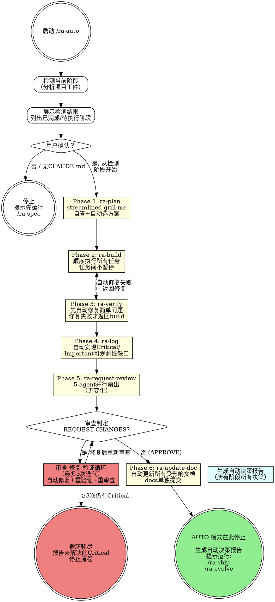
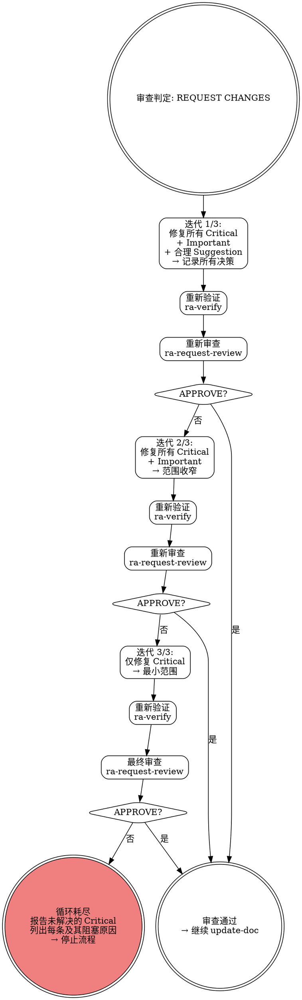

# ra-auto — 自动化工作流执行

**灵活技能**: 根据检测到的阶段和上下文自适应，但内部子技能保持各自的分类（刚性的保持刚性）。

## Overview

一键自动执行可靠工程工作流：检测项目当前所处阶段，从该阶段开始自动运行到 update-doc，自动处理审查反馈和验证循环。在 update-doc 完成后停止，提示用户手动运行 ship 和 evolve。

**核心理念**: 自动化重复的流程步骤，但保留人类在关键节点（spec 生成、ship 发布）的控制权。自动化是为了提效，不是为了绕过质量门禁。

**关键边界**:
- **从 plan 开始**（非 spec） — spec 生成 CLAUDE.md 始终需要人工交互
- **在 update-doc 停止** — ship（发布）始终需要人类批准
- **所有技术门禁完全保留** — verify、review-fix-proof-test 等刚性规则不打折扣

## When to Use

- 有已批准的方案，想一键完成 build→verify→log→review→fix→doc 全流程
- 项目已初始化（有 CLAUDE.md），想从当前阶段自动接管
- 开发过程中断，想从当前阶段自动继续
- 处理审查反馈后想自动完成后续所有阶段

**不适用**:
- 新项目无 CLAUDE.md → 先运行 `/ra-spec`
- 只需运行单个阶段 → 使用对应的 `/ra-*` 命令
- 准备发布 → 直接使用 `/ra-ship`（auto 不执行 ship）

## Core Process



## Phase Detection — 阶段检测

按优先级检测项目工件，确定当前所处阶段。检测后向用户展示结果，获得一次性确认后开始执行。

### 检测算法（按顺序匹配，首个命中即停止）

```
1. CLAUDE.md 不存在于项目根目录？
   → 阶段: HALT — 提示用户先运行 /ra-spec

2. .reliable-agent/plans/ 目录下无方案文件（*.md）？
   → 阶段: plan — 从方案设计开始

3. git log 中无方案相关提交（最近 20 条不包含 plan 中任务描述）？
   → 阶段: build — 方案已批准，实现未开始

4. git status 有未提交变更，或测试/构建命令不通过？
   → 阶段: build/verify — 有进行中的实现或验证未通过

5. 变更文件中无结构化日志模式（JSON log、correlation ID、metrics 等）？
   → 阶段: log — 实现完成但可观测性未补全

6. .reliable-agent/ 目录下无审查报告文件？
   → 阶段: request-review — 准备提交审查

7. 审查报告判定为 REQUEST CHANGES（含 Critical 或 Important 发现）？
   → 阶段: receive-review — 需要处理审查反馈

8. git diff 显示代码变更但文档文件未更新？
   → 阶段: update-doc — 文档需同步

9. 已到 update-doc 阶段（文档已更新或无需更新）？
   → 阶段: DONE — 提示用户运行 ship + evolve
```

### 检测确认输出格式

```
检测到项目当前阶段: [阶段名称]

已完成:
  [✓] ra-spec     → CLAUDE.md 已存在
  [✓] ra-plan     → 方案文件: 2026-06-18-my-feature-plan.md

待执行（auto 模式将自动完成）:
  [ ] ra-build    → 7 个任务待实现
  [ ] ra-verify   → 实现后自动验证
  ... (后续阶段)
  [ ] ra-update-doc

将从此阶段开始接管: [阶段名称]
是否继续？（一次性确认，后续阶段自动执行）
```

## Per-Phase Auto Behavior — 各阶段自动行为

### Phase 1: ra-plan（自动模式）

在自动模式下，plan 的交互步骤被 AI 自答替代：

- **Grill-me 自答**: AI 对 6 个对抗维度（边界情况、失败模式、一致性、范围、安全、性能）进行自我提问并基于需求推理回答。无法确定的歧义记录为假设。
- **自动选择方案**: 提出 2-3 个方案后，自动选择最简可行方案（偏好简单、无聊但可靠的方案）。记录选择理由。
- **方案审批**: 用户对 auto 模式的一次性确认替代逐阶段审批。方案保存到 `.reliable-agent/plans/YYYY-MM-DD-<topic>-plan.md`。
- **HARD-GATE 解释**: plan 的 "在人类批准方案之前不要调用实现技能" 由用户对 auto 运行的初始批准满足。

**自动决策记录**:
- 选择了哪个方案及其理由
- 用户在 grill-me 中未确认的假设
- 哪些 grill-me 答案由 AI 自答 vs 标记为不确定

### Phase 2: ra-build（自动模式）

- **顺序执行**: 按方案中任务的依赖顺序依次执行，任务间不暂停。
- **无需逐任务批准**: 每个任务完成 RED→GREEN→REFACTOR→COMMIT 后立即进入下一个。
- **自动解决简单歧义**: 遇到简单歧义时选择最简解释，记录决策。
- **遇到阻塞时停止**: 如果测试失败原因不明、架构假设被推翻、或需要人类判断的权衡 → 停止并报告。
- **所有 TDD 刚性规则完全保留**: RED→GREEN→REFACTOR 循环、每任务 <= 100 行、不跨任务混合提交。

**自动决策记录**:
- 执行的任务数和提交数
- 自动解决的所有歧义
- 重构决策

### Phase 3: ra-verify（自动模式）

- **先自动修复再失败**: 遇到失败时不立即返回 build，先尝试自动修复：
  1. Lint 错误 → 运行 `eslint --fix` / `prettier --write`
  2. 类型错误 → 修复无歧义的错误（缺少 import、类型标注错误）
  3. 简单测试失败 → 如果断言值明显偏差，修正断言
- **自动修复失败则返回 build**: 复杂失败（逻辑错误、架构问题）停止并返回 build。
- **所有检查仍完整运行**: 测试套件 + lint + 构建 + 类型检查 + 覆盖率 + 调试代码扫描。

**自动决策记录**:
- 哪些失败被自动修复及修复方式
- 哪些失败需要人工介入

### Phase 4: ra-log（自动模式）

- **自动实现 Critical/Important 缺口**: 无需用户确认，自动补充结构化日志、指标、追踪。
- **AI 自定 on-call 问题**: 基于代码变更自动生成 2-4 个 on-call 问题。
- **跳过人工审查缺口报告**: 缺口报告自动生成并接受。
- **记录新模式**: 如有新的可观测性模式，自动更新 CLAUDE.md。

**自动决策记录**:
- 定义的 on-call 问题
- 添加的 instrumentation
- 延迟的 Notable 缺口及原因

### Phase 5: ra-request-review（自动模式）

- **无行为变化**: 此阶段本身已自动化（5-agent 并行扇出）。正常运行。
- **判定路由**: APPROVE → 继续 update-doc。REQUEST CHANGES → 进入审查-修复-验证循环。

### Phase 6: 审查-修复-验证循环

这是自动模式最复杂的部分。详见下方 [Review-Fix-Verify Loop](#review-fix-verify-loop) 章节。

### Phase 7: ra-update-doc（自动模式）

- **自动更新所有受影响文档**: 扫描 git diff，识别受影响文档，全部更新。
- **自动生成 changelog**: 如有用户可见变更，自动生成 changelog 条目。
- **跳过逐文档审批**: 作为 auto 模式合同的一部分，文档自动更新。
- **docs 单独提交**: 文档变更仍以 `docs:` 前缀单独提交。

**自动决策记录**:
- 更新了哪些文档
- 生成了哪些 changelog 条目

## Review-Fix-Verify Loop — 审查-修复-验证循环

审查反馈自动处理的核心机制。当 `ra-request-review` 返回 REQUEST CHANGES 时触发。最多 3 次迭代，每次迭代范围收窄。



### 迭代规则

| 迭代 | 修复范围 | 说明 |
|------|---------|------|
| **1/3** | Critical + Important + 合理 Suggestion | 全面修复，接受明显改善代码的建议 |
| **2/3** | Critical + Important | 范围收窄，不再处理 Suggestion |
| **3/3** | 仅 Critical | 最小范围，只修复阻塞性问题 |

### 每条发现的自动处理

**Critical**:
1. 写证明测试（必须失败——证明问题存在）
2. 实现修复
3. 确认测试通过
4. 记录 file:line + 问题 + 修复 + 证明测试

**Important**:
1. 实现针对性修复
2. 验证修复解决关注点
3. 记录 file:line + 问题 + 修复

**Suggestion**（仅迭代 1 处理）:
1. 评估: 是否明显改善代码且不引入风险？
2. 如果是 → 实现改进
3. 如果否或模糊 → 记录拒绝理由
4. 如需大规模重构 → 拒绝并记录

### 循环终止条件

- **正常终止**: 审查判定 APPROVE（无 Critical 且无 Important）
- **循环耗尽**: 3 次迭代后仍有 Critical → 停止，报告未解决问题
- **用户中断**: 任何时刻用户可以停止 auto 模式

### 循环耗尽报告格式

```
审查-修复-验证循环已耗尽（3/3 次迭代完成）

未解决的 Critical 发现:
  1. [file:line] — [问题描述]
     原因: [为什么 3 次迭代无法解决]
     建议: [需要人类判断/决策的方向]

建议: 先解决上述问题，然后重新运行 /ra-auto 从 receive-review 继续。
```

## Stop Condition — 停止条件

update-doc 完成后，auto 模式必须:

1. **生成自动决策报告**（格式见下方）
2. **显示完成检查清单**
3. **显示下一步提示**

### 停止输出格式

```
━━━━━━━━━━━━━━━━━━━━━━━━━━━━━━━━━━━━━━━━━
  Reliable-Auto 自动执行完成
━━━━━━━━━━━━━━━━━━━━━━━━━━━━━━━━━━━━━━━━━

已完成的阶段:
  [✓] ra-plan           → 方案: 2026-06-18-my-feature-plan.md
  [✓] ra-build          → 7 个任务, 7 个提交
  [✓] ra-verify         → 全部通过 (自动修复 2 个 lint 问题)
  [✓] ra-log            → 3 个 on-call 问题, 12 条日志/指标
  [✓] ra-request-review → APPROVE (0 Critical, 0 Important)
  [✓] ra-update-doc     → 更新 README.md + CHANGELOG.md

━━━━━━━━━━━━━━━━━━━━━━━━━━━━━━━━━━━━━━━━━
  下一步（手动运行）:
━━━━━━━━━━━━━━━━━━━━━━━━━━━━━━━━━━━━━━━━━

  /ra-ship          — 最终发布门禁（提交+PR+合并，需人类批准）
  /ra-evolve        — Session 回顾、经验提取与进化建议

━━━━━━━━━━━━━━━━━━━━━━━━━━━━━━━━━━━━━━━━━
  自动决策报告已生成（见上方）
━━━━━━━━━━━━━━━━━━━━━━━━━━━━━━━━━━━━━━━━━
```

## Auto-Decision Report — 自动决策报告

在 auto 模式结束时生成，记录所有自动做出的决策。按阶段组织。

```markdown
## 自动决策报告 — ra-auto

### 元信息
- 起始阶段: [阶段]
- 结束阶段: update-doc
- 总耗时: [估算]
- 审查循环次数: N/3

### 1. Plan 阶段
- 设计方案: [选择方案 X / N]
- 选择理由: [简述]
- AI 自答的 grill-me 问题: [列表]
- 标记为不确定的歧义: [列表或"无"]

### 2. Build 阶段
- 执行任务: N/N
- 自动解决的歧义: [列表或"无"]
- 遇到阻塞: [列表或"无"]

### 3. Verify 阶段
- 最终结果: 全部通过 / 自动修复后通过
- 自动修复的问题: [列表或"无需修复"]
- 返回 build 的次数: N

### 4. Log 阶段
- 定义的 on-call 问题: [列表]
- 实现的 instrumentation: [摘要]
- 延迟的 Notable 缺口: [列表或"无"]

### 5. Request-Review 阶段
- 审查判定: APPROVE / REQUEST CHANGES
- 发现统计: N Critical, N Important, N Suggestion

### 6. Receive-Review 阶段（如有）
- 循环次数: N/3
- Critical 修复: N, 驳回: N（附理由）
- Important 修复: N, 驳回: N（附理由）
- Suggestion 接受: N, 拒绝: N（附理由）
- 未解决的 Critical: [列表或"无"]

### 7. Update-Doc 阶段
- 更新的文档: [列表]
- Changelog 条目: [简述]

### 8. 下一步
- [ ] 运行 /ra-ship
- [ ] 运行 /ra-evolve（session 回顾+经验提取+进化建议）
```

## Common Rationalizations

| 借口 | 现实 |
|------|------|
| "Auto 模式可以跳过 grill-me" | Grill-me 仍由 AI 自答——6 个维度全部覆盖。跳过的只是等待用户回答的时间，不是对抗性思考。 |
| "Auto 模式修复了所有审查反馈所以不需要重审查" | 修复可能引入新问题。每次修复后重新审查不是可选的——它是审查-修复循环的核心。 |
| "审查循环 3 次太多了，1 次就够了" | 3 次是上限，不是目标。大多数情况 1-2 次足够。上限防止无限循环。 |
| "文档变更很小，合并到代码提交里就行" | 文档单独提交使回滚精确。`docs:` 前缀提交可以独立 revert 而不影响代码。 |
| "Auto 做到 ship 不更好吗？一步到位" | Ship 涉及 push、创建 PR、合并——这些都是安全边界。自动发布意味着未审查代码可能进入生产。 |
| "验证失败我可以手动修，不用回 build" | 自动修复是有限范围的（lint --fix、简单类型错误）。复杂失败必须回 build——用完整 TDD 循环修复，不能打补丁。 |

## Red Flags

- 在 auto 模式中运行 ra-spec（规范生成永远手动）
- 跳过阶段检测直接假设当前阶段
- 审查循环 >= 3 次后仍继续
- 在 update-doc 后自动进入 ship
- 自动修复时引入新的逻辑变更（修复应该是机械性的）
- 自动决策报告不完整或缺少关键决策记录
- 在 CLAUDE.md 不存在的情况下继续执行
- 修复 Critical 无证明测试

<HARD-GATE>
绝不在 auto 模式下运行 ra-spec（规范生成始终需要人工交互）。
绝不在 auto 模式下执行 ra-ship（发布始终需要人类批准）。
绝不跳过可靠验证（ra-verify）的完整运行——即使修复看起来简单。
每个阶段必须记录所有自动决策，生成透明报告。
审查-修复-验证循环最多 3 次。3 次后仍有 Critical 未解决 → 停止并报告未解决问题。
如果任何阶段遇到无法自动解决的阻塞（需要人类判断的模糊性、需要人类决策的权衡）→ 停止并提示用户。
修复 Critical 发现必须有证明测试（先失败→修复→通过）。
</HARD-GATE>

## Verification

- [ ] 阶段检测正确识别了项目当前阶段
- [ ] 检测结果已向用户展示并获得一次性确认
- [ ] 每个阶段执行完毕且有记录
- [ ] 自动修复的问题已记录（verify 阶段和 receive-review 阶段）
- [ ] 审查循环未超过 3 次
- [ ] 自动决策报告完整（覆盖所有阶段）
- [ ] 停止在 update-doc（未进入 ship）
- [ ] 下一步指引已显示（ship + evolve）
- [ ] 所有 Critical 修复有证明测试

## 下一步指引

**AUTO 模式在此停止。请手动运行:**

1. **`/ra-ship`** — 最终发布门禁：验证所有质量门禁 → 检查提交格式 → 生成 PR 描述 → 需要人类批准 push
2. **`/ra-evolve`** — Session 回顾与进化：提取结构化经验 → 追加到 experiences.md → 聚类分析 → 生成 Type A/B/C 建议 → 需人类批准后应用

**如果 auto 模式中途停止（遇到阻塞）**:
- 解决阻塞问题后，重新运行 `/ra-auto` — 它会从当前阶段继续
- 或手动运行对应的 `/ra-*` 命令继续单个阶段
