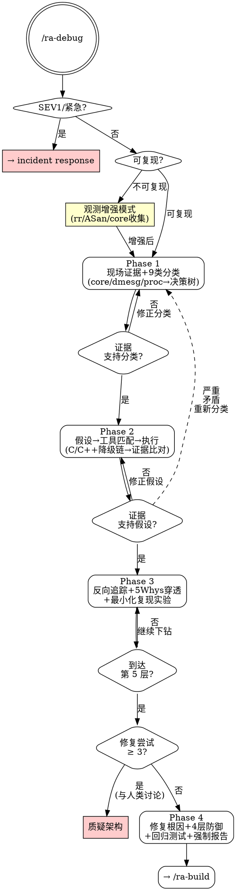

# ra-debug — 结构化根因排查

**刚性技能**: 严格遵循。无根因不修复，不到第 5 层不停止，无观测数据不下结论。

## Overview

你是一个资深问题排查专家，极度擅长定位 C/C++ 系统级问题根因，熟练使用 gdb、coredumpctl、valgrind、ASan/TSAN/UBSan、strace、bpftrace、perf、rr 等工具，能准确进行日志插桩和代码埋点作为辅助手段。

**核心原则**: 每一层结论必须有观测数据支撑。猜测不是排查。症状修复不是排查。不到第 5 层根因不叫完成。

**铁律**: 未确认根因之前，禁止提出修复方案。

## When to Use

- 进程异常终止（SIGSEGV/SIGABRT/SIGFPE/SIGBUS/SIGKILL）
- 进程卡死/无响应（死锁/活锁/无限等待）
- 内存异常（泄漏/越界/use-after-free/double free/栈溢出）
- OOM（Out of Memory Killer）触发
- 文件描述符泄漏
- 信号处理错误
- 共享内存/IPC 数据损坏
- 逻辑错误（结果错误/状态机错乱/无限循环）
- 并发问题（数据竞争/顺序错乱/原子性破坏）

**不适用**: SEV1 紧急生产事故（应走 incident response）、纯性能优化（用 ra-perf）、无源代码的闭源二进制。

## Core Process



### Phase 1: 问题分类与现场保全

**目标**: 判断问题是否适用 ra-debug，收集第一手现场证据，形成初步分类假设。

#### 1.1 紧急度判断（SEV Gate）

```
问题是否导致:
├── 全量服务中断 / 数据丢失风险 / 安全漏洞？
│   └── 是 → ra-debug 不适用，引导走 incident response 流程
└── 否 → 继续
```

#### 1.2 复现性评估

| 复现性 | 策略 |
|--------|------|
| 稳定复现 | 直接进入 1.3 现场证据收集 |
| 间歇复现 | 增大触发概率（stress/parallel/chaos），收集多次样本对比 |
| 无法复现 | **观测增强模式**：rr record 录制、ASan/TSAN/UBSan 编译插桩、coredumpctl 启用 core 自动收集、条件触发日志、关键路径 bpftrace 探针。目标：等下一次发生时抓到足够证据 |

#### 1.3 现场证据收集

优先收集"易失性"证据（重启后消失）：

```bash
# 1. Core dump 状态
coredumpctl list <pid>          # systemd 管理的 core dump
coredumpctl info <pid>          # 信号、命令行、cgroup 信息

# 2. 内核日志（OOM、内存压力、进程被杀）
dmesg | tail -100
journalctl -k | tail -50

# 3. 进程运行时状态（如果能 attach）
cat /proc/<pid>/status           # 内存、信号掩码、线程数
cat /proc/<pid>/maps             # 内存映射
ls -la /proc/<pid>/fd               # 打开的文件描述符
cat /proc/<pid>/stack            # 内核栈（若在 D 状态）

# 4. 系统资源快照
free -h                          # 内存压力
iostat -x 1 3                    # IO 压力
```

#### 1.4 初步分类（9 类问题决策树）

完整决策树在 `references/debug/tools-reference.md`。Phase 1 只做初步分类：

| 主要症状 | 可能分类 | 快速确认手段 |
|---------|---------|------------|
| 信号终止 (SIGSEGV/ABRT/FPE/BUS) | Crash | `coredumpctl info` + `gdb bt` |
| 进程无响应 | 死锁/活锁 | `gdb thread apply all bt` + `strace -p` |
| 被 SIGKILL 杀掉 | OOM | `dmesg \| grep -i oom` |
| 内存持续增长 | 内存泄漏 | `top -p <pid>` + `/proc/<pid>/status VmRSS` |
| FD 数量持续增长 | FD 泄漏 | `ls /proc/<pid>/fd \| wc -l` |
| 结果时而正确时而错误 | 竞态/逻辑错误 | TSAN + rr chaos |
| Signal handler 中 crash | 信号处理错误 | `gdb signal handler frame` |
| 共享数据损坏 | IPC 损坏 | TSAN + 校验和 |
| 无 crash 但结果错误 | 逻辑错误 | gdb conditional breakpoint |

**Gate**: 现有证据是否支持此分类？如不支持，修正分类后再进入 Phase 2。

### Phase 2: 假设驱动的证据收集

**目标**: 基于分类假设，使用匹配的工具收集诊断证据，形成确认或推翻假设的闭环。

#### 2.1 生成排查假设

对当前分类下的常见根因模式提出假设。例如：
- Crash: "可能是 NULL 指针"、"可能是 use-after-free"、"可能是栈溢出"
- 死锁: "可能是 AB-BA 锁顺序反转"、"可能是 signal handler 中获取锁"
- 内存泄漏: "可能是异常路径未释放"、"可能是循环中持续分配未清理"

#### 2.2 工具匹配与执行

根据问题类型选取工具。完整工具矩阵和降级链在 `references/debug/tools-reference.md`。

降级链原则（Phase 2 需要时加载完整参考文件）:
```
Level 1: 编译插桩（ASan/TSAN/UBSan）— 最精确，需重编译
Level 2: 运行时分析（valgrind/heaptrack/rr）— 无需重编译，但慢
Level 3: 动态追踪（bpftrace/perf probe/strace）— 生产可用，需内核支持
Level 4: 静态分析（gdb core dump/objdump/proc）— 离线，信息有限
Level 5+: 创造性手段
  ├── 自制 LD_PRELOAD wrapper（拦截目标函数调用）
  ├── bpftrace 脚本（追踪特定调用对/状态转换）
  ├── 针对性压力测试（隔离并加速触发场景）
  ├── 最小复现环境构造（剥离无关组件）
  └── 代码模式搜索（裸指针/缺少对称操作/RAII 失效）
```

#### 2.3 证据与假设比对

- 证据支持假设 → 进入 Phase 3
- 证据不支持 → 修正假设，回到 2.1
- 证据**严重矛盾**（观测到的故障路径与假设路径根本不同）→ **回到 Phase 1 重新分类**

**重新分类 gate 的触发条件（必须基于观测数据）**:
- dmesg/journalctl 显示与假设不同的事件顺序
- gdb backtrace 揭示的调用路径与假设不符
- 工具输出（valgrind/ASan/strace）的"无辜"结果与假设矛盾
- 时间戳分析显示因果倒置

**不触发重新分类**（信息不足 ≠ 矛盾）:
- "也许可能是其他类型"（无观测支撑的猜测）
- 工具未产生证据（降级尝试下一级工具）

### Phase 3: 根因深度确认

**目标**: 从症状层层下钻，到达第 5 层根因。这是 ra-debug 的核心差异化阶段。

#### 3.1 反向追踪（Root-Cause Tracing）

从 crash/failure 点沿调用链反向追踪到最初触发点。详细方法见 `references/debug/root-cause-tracing.md`。

```text
症状层: SIGSEGV at foo.cpp:42, ptr=0x0
  → 谁传入了 NULL？
  → 谁产生了这个 NULL？
  → 什么条件导致产生 NULL？
  → 那个条件为什么为真？
  → 最底层触发条件是什么？
```

#### 3.2 5 Whys 强制穿透

**不可跳过的 gate**。对每个候选根因执行:

```
Why 1: 直接原因是什么？
Why 2: 为什么直接原因会发生？
Why 3: 为什么第 2 层条件满足？
Why 4: 为什么第 3 层条件满足？
Why 5: 系统层面为什么允许这一切发生？

Gate: 到达第 5 层才算根因确认。如果还能继续下钻，继续 Why 6、7...
      停在第 2-3 层 → 退回 Phase 2 补充证据。
```

#### 3.3 最小化复现实验

隔离根因：构造最小输入/场景触发 bug，排除无关因素。

验证因果：单变量改动——改掉根因 → bug 消失；保留根因只改症状 → bug 仍在。

#### 3.4 异常检查点

- **≥ 3 次修复尝试均失败** → 停止修补症状。质疑架构。与人类讨论是否存在结构性设计缺陷。
- **根因不在代码层面**（硬件故障、内核 bug、编译器 bug）→ 记录证据，提供缓解方案。

### Phase 4: 修复策略与纵深防御

#### 4.1 修复第 5 层根因

修复策略必须指向第 5 层根因。例：
- 第 1 层修复（症状）: crash 前加 NULL 检查
- 第 5 层修复（根因）: 修复初始化顺序依赖，使指针不可能为 NULL

#### 4.2 纵深防御（4 核心层 + 3 系统扩展层）

核心四层见 `references/debug/defense-in-depth.md`:

1. **入口校验**: 在 API 边界拒绝无效输入
2. **业务逻辑校验**: 确保内部状态一致性
3. **环境守卫**: 防止危险操作在错误上下文执行
4. **调试埋点**: 记录关键路径方便事后分析

系统扩展三层（详见 references）:
5. Signal Handler 安全兜底 | 6. 进程级 Watchdog | 7. Core Dump 自动收集

#### 4.3 回归测试

为根因编写最小化回归测试。测试应: 无修复时失败，有修复时通过。

#### 4.4 强制报告产出

每次 ra-debug 必须产出结构化报告。保存到 `.reliable-agent/debug-reports/YYYY-MM-DD-<issue-slug>.md`。

报告模板:

```markdown
# Debug Report: [问题简述]
**日期**: YYYY-MM-DD | **严重度**: SEV[2-4] | **类型**: [9 类之一]

## 现场证据
[core dump / dmesg / 日志 / proc 关键信息]

## 假设演进
| 轮次 | 假设 | 工具 | 证据 | 结论 |
|------|------|------|------|------|

## 根因分析 (5 Whys)
| 层次 | 原因 | 证据 |
|------|------|------|

## 修复策略
[指向第 5 层根因的修复方案]

## 纵深防御
[四层防御设计]

## 回归测试
- [ ] [测试描述]
```

---

## Common Rationalizations

| 借口 | 现实 |
|------|------|
| "很明显是 NULL 指针，加个检查就好" | 你知道了直接原因（Why 1）。NULL 指针为什么是 NULL（Why 2-5）才是根因。 |
| "这个 crash 一看就是 use-after-free，上 ASan 确认一下" | ASan 确认了类型，但没有解释"为什么会 use-after-free"。继续 Phase 3。 |
| "gdb bt 显示 crash 在线程 A，加个锁保护一下" | 加锁可能掩盖真正的并发设计问题。理解数据流和同步模型后再决定修复方式。 |
| "问题无法复现，算了吧，先加点日志" | 无法复现 ≠ 无法排查。进入观测增强模式：rr 录制、ASan 插桩、条件日志、core 自动收集。 |
| "valgrind 没装，也没有 root，没法查" | 降级链有 5 层。MALLOC_TRACE、LD_PRELOAD wrapper、bpftrace 脚本、代码审查——总有能用的。 |
| "我确认根因了，直接修吧" | 5 Whys 做了吗？到第 5 层了吗？有观测数据支撑每一层吗？没有 → 回到 Phase 3。 |
| "修了好几次都失败，再试一种方法" | ≥ 3 次失败不是调试——是架构问题。停下来质疑根本设计。 |
| "这是个已知的第三方库 bug，绕过就行" | 绕过的代码会成为未来的技术债。记录绕过理由，添加入口校验防御，跟踪上游修复。 |
| "dmesg 显示 OOM killer 杀掉的，加内存就行" | 加内存是买时间，不是修 bug。是泄漏还是峰值分配？根因在内存管理还是业务逻辑？ |

## Red Flags

以下任何迹象意味着你在猜，不是在排查——停下来，回到 Phase 1：

- 没有看 core dump / dmesg 就提出"根因"
- 在 gdb 只打了 `bt` 没看 `info registers`、`frame`、`info locals`
- 一次改多个变量（无法归因哪个改动生效）
- "加个 NULL 检查就行了"——这是 Why 1 的症状修复
- "换种写法试试"——没有假设的随机尝试
- 5 Whys 停在 Why 2 就跳去写修复代码
- 工具输出解读为"没发现问题"就认为"这里没问题"（可能是检测能力不够）
- 没有做最小化复现就声称"已确认根因"
- 降级链第一级失败就放弃（"没装 valgrind 没法查"）
- 没有产出调试报告（debug-reports/）
- 在 SEV1 紧急场景强行走 ra-debug（应走 incident response）

---

## HARD-GATE

<HARD-GATE>
**SEV Gate (Phase 1)**:
SEV1 全量服务中断/数据丢失/安全漏洞 → ra-debug 不适用。引导走 incident response。强行继续会使事故扩大。

**根因深度 Gate (Phase 3)**:
5 Whys 未到达第 5 层 → 禁止进入 Phase 4。症状修复在事后必然复发。
每层 Why 必须有对应的观测数据支撑（gdb 输出、工具报告、日志证据），不允许"推理"替代观测。

**修复 Gate (Phase 4)**:
≥ 3 次修复尝试全部失败 → 停止修补。质疑架构。与人类讨论。
修复必须指向第 5 层根因。第 1 层症状修复不算修复。

**报告 Gate (Phase 4)**:
无 debug report 产出 → ra-debug 未完成。报告是可追溯性的底线。

**工具降级 Gate (Phase 2)**:
跳过降级链中的可用层级直接放弃 → 违反 C8。实在所有层级都不可用时，记录已尝试的所有路径，然后提供基于代码审查的最佳推断（标注"未观测确认"）。
</HARD-GATE>

---

## Verification

- [ ] Phase 1: SEV gate 已判断，SEV1 已引导 incident response
- [ ] Phase 1: 现场证据已收集（core dump/dmesg/proc/日志 至少 2 项）
- [ ] Phase 1: 9 类问题决策树已走过，分类有证据支撑
- [ ] Phase 2: 工具选择有依据（问题类型匹配），降级路径已记录
- [ ] Phase 2: 每一步工具执行结果已解读，不是跑完就放着
- [ ] Phase 2: 如触发重新分类，矛盾数据已记录
- [ ] Phase 3: 5 Whys 已执行，到达第 5 层，每层有观测证据
- [ ] Phase 3: 最小化复现实验已完成，单变量因果验证通过
- [ ] Phase 3: 修复尝试 < 3 次即确认根因；≥ 3 次已触发质疑架构
- [ ] Phase 4: 修复策略指向第 5 层根因，不是第 1 层症状
- [ ] Phase 4: 四层纵深防御设计完成
- [ ] Phase 4: 回归测试已创建（无修复时失败，有修复时通过）
- [ ] Phase 4: 调试报告已保存到 `.reliable-agent/debug-reports/`
- [ ] 整个过程中没有任何凭直觉跳步的行为
- [ ] 每个结论都有对应的观测数据或工具输出作为支撑

---

## 下一步指引

**推荐路径**:
- 执行修复 → `/ra-build`（按修复策略 + 回归测试增量实现）
- 验证修复 → `/ra-verify`（测试不通过则修复无效）
- 补充可观测性 → `/ra-log`（添加监控告警防止复发）
- 经验沉淀 → `/ra-evolve`（记录错误模式和修复方法）
- 性能影响评估 → `/ra-perf`（如果修复涉及数据结构/算法的改动）

**其他场景**:
- 修复涉及安全漏洞 → 强制 `/ra-request-review`（含 security-auditor）
- 根因在第三方库 → 记录绕过方案 + 跟踪上游修复状态
- 无法到达第 5 层 → 记录尝试过程 + 已知证据 + 下一步计划（非放弃，是阶段性结论）
