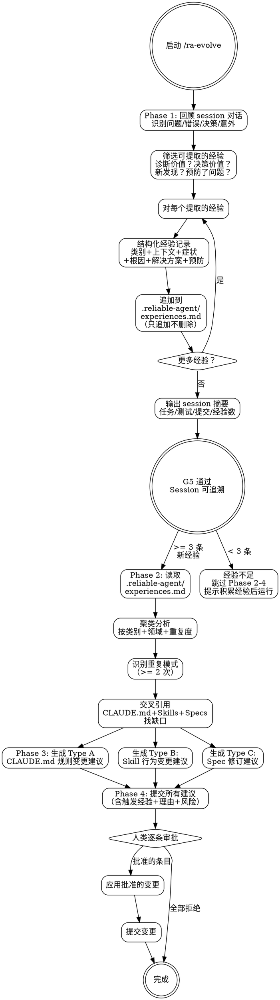

# ra-evolve — Session 回顾与经验驱动的进化

**灵活技能**: 根据上下文调整原则。

## Overview

这是可靠工程循环的最后一步，合并了 session 回顾和经验驱动的进化。**Phase 1** 回顾当前 session 并提取结构化经验记录（追加到 `.reliable-agent/experiences.md`，只追加不删除）。**Phase 2-4** 读取经验文件，通过聚类分析识别重复模式，生成三类变更建议。所有建议不经人类批准绝不自动应用。

**核心理念**: 新鲜的经验是最详细和准确的经验。延迟的回顾含糊且不完整。进化不是自动的——AI 可以做模式识别和建议生成，但改变行为的决定权在人类。

## When to Use

- 每个重要工程 session 结束时
- 代码被修改、提交或审查后
- 遇到并解决了非平凡的问题后
- 积累多条经验后（建议 >= 3 条新经验）
- 周期性（例如每个 sprint 结束时）
- 重复问题出现在多次 code review 中
- 用户主动要求分析项目经验

**不适用**: 纯讨论 session（无代码修改）。

## Core Process



---

## Phase 1: Session 回顾与经验提取

### Step 1: 回顾 Session

扫描对话记录中的：
- 遇到的问题
- 错误及其根因
- 调试路径（尝试了什么、什么有效）
- 做出的决策及其理由
- 意外（不像预期那样工作的事情）
- 顺利的事情（值得重复的模式）
- 完成标准: 所有重要事件已识别

### Step 2: 筛选可提取的经验

标准——回答 YES 到任一问题：
- 这能帮助未来的人（含未来的你）更快诊断类似问题吗？
- 这能防止类似上下文的错误决策吗？
- 这揭示了一个过去不明显的模式吗？
- 一个流程/技能步骤是否被证明预防了问题？（正向强化）
- 完成标准: 经验列表已筛选

### Step 3: 结构化每条经验

使用标准格式：
```markdown
### EXP-[YYYY-MM-DD]-[NNN]: [简短标题]

- **类别**: error-pattern | optimization-discovery | review-recurrence | workflow-friction | security-finding | process-win
- **日期**: [session 日期]
- **上下文**: [事件发生时我们在构建/修复什么]
- **症状**: [可观察行为——我们看到了什么]
- **根因**: [根本原因——为什么会发生]
- **解决方案**: [什么修复了它]
- **预防**: [什么能防止再次发生]
- **相关文件**: [具体涉及的文件/模块]
- **严重度**: critical | important | notable
- **标签**: [逗号分隔的关键词，便于搜索]
```
- 如果经验明确暗示需要 CLAUDE.md 规则变更或 skill 修改：添加 `[FLAG-EVOLVE]` 标记
- 完成标准: 经验已按格式结构化

### Step 4: 追加到 `.reliable-agent/experiences.md`

- **始终追加**（绝不删除或重写已有记录）
- 添加在适当的类别标题下
- 完成标准: 经验已持久化

### Step 5: Session 摘要

- 完成的任务数
- 新增的测试数
- 提交数
- 记录的经验数
- 完成标准: 摘要已输出；G5 通过（经验已提取，session 可追溯）

---

## Phase 2: 经验加载与分析

### Step 6: 加载经验

- 读取 `.reliable-agent/experiences.md`
- 收集所有经验记录（重点关注 >= 3 条新记录或带 `[FLAG-EVOLVE]` 标记的记录）
- 完成标准: 所有经验已加载

### Step 7: 聚类分析

按以下维度分组：
- 类别: error-pattern, optimization-discovery, review-recurrence, workflow-friction, security-finding, process-win
- 领域: 代码库或工作流的哪部分
- 重复度: 相同根因出现 >= 2 次
- 完成标准: 经验已聚类，重复模式已识别

### Step 8: 识别缺口

将重复经验与以下交叉引用：
- CLAUDE.md 边界规则: 重复是否暗示缺少 Always/Never/Ask First？
- Skill 定义: 重复是否暗示某个 skill 步骤缺失或薄弱？
- Specs: 重复是否暗示架构模式需要更新？
- 完成标准: 缺口已识别

---

## Phase 3: 生成进化建议

### Step 9: 生成 Type A — CLAUDE.md 规则建议

- 新的边界规则（Always/Never/Ask First）
- 变更的代码规范
- 更新的安全或性能基线
- 每条建议包含: 触发经验、确切规则文字、理由、应用风险
- 完成标准: Type A 建议已生成

### Step 10: 生成 Type B — Skill 变更建议

- 新增 skill 步骤
- 修改的验证检查清单
- 额外的借口反驳条目
- 变更的门禁条件
- 每条建议包含: 触发经验、确切变更 diff、理由、对流程的影响
- 完成标准: Type B 建议已生成

### Step 11: 生成 Type C — Spec 修订建议

- 架构模式变更
- API 合约更新
- 数据模型修订
- 每条建议包含: 触发经验、确切变更、理由、迁移影响
- 完成标准: Type C 建议已生成

---

## Phase 4: 人类审批与应用

### Step 12: 提交建议

- 所有建议按类型组织的结构化输出
- 每条包含: 触发经验、变更内容、理由、风险
- 完成标准: 建议列表已展示

### Step 13: 人类审批

- **逐条审批，不批量**
- 批准后: 仅应用批准的变更
- 拒绝: 记录拒绝不应用
- 完成标准: 所有建议已有审批决定

### Step 14: 应用与提交

- 只应用批准的变更
- 批准的变更逐一提交，不混合在一次提交中
- 完成标准: 变更已提交

<HARD-GATE>
绝不删除或重写 `.reliable-agent/experiences.md` 中已有的经验记录（追加模式）。
Session 有代码修改时必须运行 Phase 1（经验提取），不要跳过。
绝不自动应用任何进化建议——全部需人类明确批准。
拒绝的建议记录但不应用。
批准的变更逐一提交，不混合在一次提交中。
</HARD-GATE>

## Common Rationalizations

| 借口 | 现实 |
|------|------|
| "这个 session 没什么重要的事发生" | 每个 session 都有学习。如果找不到，你看的不够深。即使"一切顺利因为 X"也是学习。 |
| "稍后做回顾" | 细节衰退很快。现在显而易见的根因明天就变成谜团。今天记录的经验明天就能防止回归。 |
| "这个经验太具体没什么用" | 具体经验帮助诊断具体问题。泛泛的建议已经在 CLAUDE.md 里了。 |
| "这个经验一次性的" | 造成显著延迟的"一次性"事件值得记录。"不会再发生"是重复发生的方式。 |
| "这个经验只发生过一次，不需要进化" | 一次严重事件就够了。重复阈值存在是为了置信度，不是必需性。 |
| "让我自动应用这些改进" | 进化改变代理行为。人类审查是非预期后果的安全机制。 |
| "改动很小，直接应用就行" | 小改动在聚合时可能有重大影响。每条建议独立审查。 |

## Red Flags

- 代码被修改的 session 不运行 evolve 的 Phase 1
- 只记录症状不分析根因
- 删除或重写已有经验记录（违反追加模式）
- 对明确需要规则变更的经验跳过 FLAG-EVOLVE
- 未人类批准就应用建议
- 生成建议但不链接到具体经验记录
- 建议移除已有的安全检查
- 为未实际发生的问题生成建议

## Verification

### Phase 1（Session 回顾）
- [ ] Session 对话已回顾
- [ ] 至少一条经验被记录（代码变更的 session）
- [ ] 每条经验有: 类别、上下文、症状、根因、解决方案、预防
- [ ] 经验已追加到 .reliable-agent/experiences.md（非覆写）
- [ ] 经验已加标签关键词便于搜索
- [ ] FLAG-EVOLVE 标记已为需要规则/skill 变更的经验添加
- [ ] Session 摘要已输出: 任务、测试、提交、经验数

### Phase 2-4（经验分析与进化）
- [ ] .reliable-agent/experiences.md 已读取且所有经验已编录
- [ ] 重复模式（>= 2 次）已识别
- [ ] 每条建议链接到具体触发经验
- [ ] 每条建议包含: 触发、确切变更文字、理由、风险
- [ ] 未经人类批准未自动应用任何建议
- [ ] 批准的建议逐一提交
- [ ] 应用的 CLAUDE.md 变更通过 ra-spec 验证

### 综合
- [ ] G5: 经验已提取，session 可追溯

## 下一步指引

**推荐路径**:
- 如果刚完成 Phase 1（经验 < 3 条）→ `/ra-plan` — 开始下一个功能迭代的设计方案
- 如果完成了 Phase 2-4 → `/ra-update-doc` — 经验分析和进化建议完成，同步更新项目文档

**其他选项**:
- `/ra-build` — 立即实现人类已批准的进化建议
- `/ra-spec` — 如果是新项目，初始化项目规范
