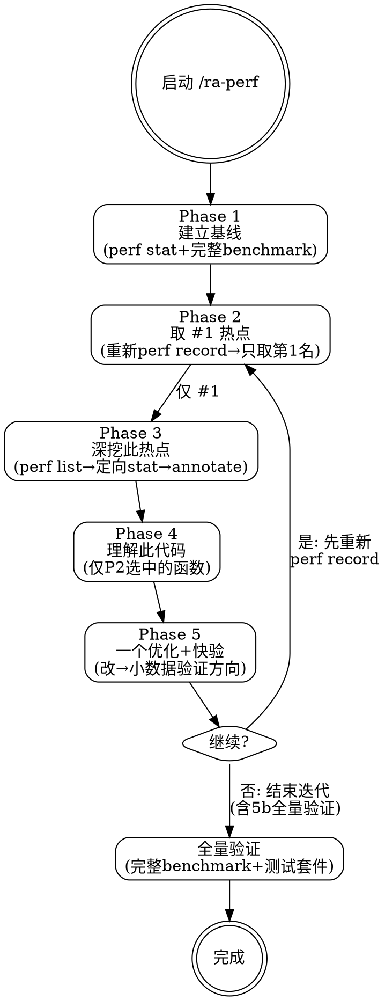

# ra-perf — 热点驱动深度性能优化

**刚性技能**: 严格遵守「建立基线→取#1热点→深挖此热点→理解此代码→一个优化+验证→重新profile→再循环」的迭代纪律。**一轮 = 一个热点的一个优化**。

## Overview

不是五维广度扫描，而是**热点驱动的深度迭代**：

1. `perf record` 告诉你**哪里**慢
2. `perf list` 确认本平台可用事件，`perf stat` 告诉你**为什么**慢
3. `perf annotate` 告诉你**哪行代码**慢
4. 读代码理解**设计意图 vs 实际行为**
5. 选择优化手段（代码/编译器/运行时），修改后验证
6. **重新 profile**，新热点涌现，回到步骤 1
7. 至少 5 轮深挖，直到 IPC 饱和或热点不可约化

## When to Use

- 用户报告性能问题（"程序慢"、"延迟高"、"吞吐低"）
- 需要白盒深度优化（有源码、可重编译）
- 需要系统性挖掘多个优化点而非浅尝辄止

**不适用**: 纯 Web 前端性能、JVM GC 调优、K8s 配置问题。

## Core Process



### Phase 1: 建立基线

**目的**: 建立所有后续优化的参照系。

```bash
# 整体微架构指标
perf stat -e instructions,cycles,branches,branch-misses,\
cache-references,cache-misses,LLC-loads,LLC-load-misses \
<workload>

# 端到端耗时
time <workload>
```

**输出**: `{wall_time, throughput, ipc, instructions, cycles, branch_miss_pct, cache_miss_pct}`

后续每轮优化都与这些基线值对比。

### Phase 2: 取 #1 热点（每轮只取一个）

**⚠ 前置条件**: 必须重新运行 `perf record`（不得复用上一轮的 perf 数据）。

**目的**: 取当前 CPU 时间占比最高的**一个**函数。不得同时提取 #2, #3... 作为优化候选——它们会在后续轮次中自然出现（或消失）。

```bash
perf record -g -F 99 -- <workload>
perf report --stdio --sort=overhead,symbol -n
```

**输出**: **一个**热点函数（函数名 + 占比% + 调用栈摘要）。

**规则**:
- **只取 #1**。如果 #1 是 libc 函数（`__memset_avx2` 等），找调用它的用户函数作为真正的 #1
- 如果 #1 是内核函数，分析系统调用来源，找到触发该 syscall 的用户函数
- 如果 #1 无可优化空间（外部库、纯 memcpy 无改进空间等）→ 仍只取一个，完成本轮分析并记录"不可优化"结论，下一轮重新 perf record 找新的 #1

### Phase 3: 深挖此热点（仅针对 Phase 2 选中的那一个函数）

**目的**: 搞清楚**这一个**热点函数为什么慢——哪种微架构瓶颈。不分析其他函数。

**⚠ 平台可移植性 — 第一步必做**:
```bash
perf list                      # 列出本平台所有可用事件
perf list | grep -i cache      # 确认 cache 事件名
perf list | grep -i branch     # 确认分支预测事件名
perf list | grep -i llc        # 确认 LLC/last-level 事件名
```
不同 CPU（Intel/AMD/ARM）事件名差异很大。Reference 只写语义，用 `perf list` 查本平台名字。`--topdown` 仅 Intel Icelake+ 和 AMD Zen4+ 支持——不支持时用基础事件手工计算。

**perf 决策树**（从基础数据逐步缩小方向）:

```
perf stat 基础数据 + perf record 热点

热点函数开销 > 30%:
├── cache-misses/cache-references > 5%?
│   → 内存瓶颈: 进一步 perf stat -e L1-{loads,misses},LLC-{loads,misses}
│   → perf mem record 看数据来源（L1/L2/L3/DRAM/远端NUMA）
│
├── branch-misses/branches > 3%?
│   → 分支预测差: perf stat -e branch-misses,branch-loads
│
├── IPC < 1.0 且 cache/branch miss 都低?
│   → 前端/后端: perf stat --topdown (L1大类)
│     ├── Frontend Bound > 20% → ICache/ITLB/解码器
│     ├── Backend Bound > 20%  → 执行单元/L1/存储转发
│     └── Bad Speculation > 10% → 分支预测器
│
└── IPC > 2.0 且占比仍高?
    → 纯计算密集: 检查 SIMD 向量化机会、算法复杂度
```

**定位代码行**:
```bash
perf annotate --stdio <hotspot_function>
# 输出每行源码对应的 CPU 开销，直接看到哪行最贵
```

### Phase 4: 理解此代码（仅阅读 Phase 2 选中函数的源码）

**目的**: 从性能数据回到这一个函数的源码，理解为什么慢。不阅读其他函数。

读代码时回答：
- 这段代码在做什么？为什么需要这样做？
- 循环遍历顺序对 cache 友好吗？
- 数据结构布局是否导致了不必要的内存访问？
- 热路径上是否有可预计算/缓存的值？有无冗余操作？
- 分支可预测吗？可查表替代吗？
- 适合 SIMD 向量化吗？

**产物**: 根因（设计缺陷？路径问题？数据布局？），不是猜测，是结合 perf 数据的判断。

### Phase 5: 实施一个优化 + 快速验证

**目的**: 对 Phase 4 确认的根因，实施**一个**优化。

**优化手段三维度**（按成本排序）:

| 维度 | 手段 | 成本 | 何时用 |
|------|------|------|--------|
| 编译器 | `-O3 -march=native`, `-flto`, PGO, BOLT | 极低 | 优先检查 |
| 运行时 | `numactl`, `MALLOC_ARENA_MAX`, THP, `LD_PRELOAD=jemalloc` | 极低 | DTLB/分配/NUMA |
| 代码 | 循环交换、分支改写、数据布局、算法替换 | 低-高 | 多数热点 |

**规则**:
- **一次只实施一个优化** — 同一个函数内部有 3 个独立问题 = 需要 3 轮迭代
- **编译器/运行时手段优先尝试** — 零代码改动的收益可能出乎意料
- **重新编译后必须运行测试用例** — 编译器优化改变了二进制行为，代码修改更不用说

**两阶段验证**:

**5a. 快速验证（方向确认，目标 < 1 分钟）**:
```
用快速方式确认优化方向是否正确，不需要完整 benchmark:
- 缩短运行时间: timeout 10s <workload> 或处理 1/100 的数据量
- 采样数据: head -n 1000 替代全量输入文件
- 单次迭代: 如果 workload 是循环的，跑 1 次迭代而不是 100 次
- 关键指标: perf stat 的 IPC、cache-miss%、branch-miss% 在小数据下
  通常已能反映方向性变化——不需要全量数据就能判断优化是否正确
→ 如果方向错了 → 回退修改，重新分析，本轮不算
→ 方向正确 → 继续 5b
```

**5b. 全量验证（每轮结束前必须执行）**:
- 方向正确（5a 通过）后，运行完整 benchmark + 完整测试套件
- 正式记录 before/after: `{指标, before, after, improvement%}`
- 对比 Phase 1 基线
- 测试套件必须全部通过（HARD-GATE 要求）

### 循环: 回到 Phase 2

优化后**必须重新 `perf record`**。前一个热点消除后，新的 #1 热点自然涌现。

**进入下一轮的前置检查（必须全部满足）**:
- [ ] 本轮只修改了一个优化变量
- [ ] 已重新 `perf record`（不是复用旧的 profile 数据）
- [ ] 快速验证（5a）已通过——方向正确
- [ ] 全量验证（5b）已完成——测试套件全部通过，before/after 数据已记录

**如果前置检查不满足，不得进入下一轮。**

**继续条件**: Top 热点 > 3% / IPC 仍有提升空间 / 剩余热点在用户代码中

**停止条件**: Top 热点 < 3%（无主导瓶颈）| IPC 接近微架构理论上限 | 剩余在 kernel/libc | 用户中断

**循环纪律**: 至少 5 轮深挖。轮 = 一个热点的一个优化 + 重新 profile。不是一轮发现多个优化点。

---

## Common Rationalizations

| 借口 | 现实 |
|------|------|
| "这个改动显然会加速" | 没观测就不知道。直觉在性能领域不可靠。 |
| "先跑 iostat/sar 看看" | 别广撒网。先 `perf record` 看热点，perf 会自动告诉你瓶颈方向。 |
| "换这个算法一定快" | 算法复杂度不决定实际性能。Cache 行为往往主导。先 perf stat 看 cache miss。 |
| "编译器会自动优化" | 编译器受限于别名分析、跨文件可见性。检查 `-march=native -flto` 是否开启。 |
| "一个热点修好了，结束吧" | 修复一个热点后重新 profile——新的瓶颈必然出现。至少 5 轮。 |
| "先试几个优化看看哪个有用" | 一次改一个变量，否则无法归因。盲目试错引入新问题不自知。 |
| "加点线程就好了" | 多线程可能引入锁竞争和伪共享，反而更慢。先用 perf lock。 |
| "这个事件名我记得" | 不同平台事件名不同。先 `perf list` 确认。 |
| "一次 perf record 找到了 7 个优化点，全部改完效率更高" | 7 个优化一起改 = 无法归因哪个有效。而且前 2 个优化改了之后，后 5 个热点可能已经消失。每轮一个，逐步归因。 |
| "完整 benchmark 要跑 30 分钟，每轮都跑太慢了" | 用快速验证（5a: 小数据/采样）先确认方向，方向对了再全量验证。快速验证通常 < 1 分钟。 |
| "同一个函数里有 3 个问题，一起修了再测" | 3 个问题 = 3 轮。修完第 1 个后重新 profile，后 2 个可能已经不再是热点了。 |
| "这个热点是 libc 的 memcpy，没什么可优化的" | memcpy 是热点说明调用它太多。深挖: 能否减少 memcpy 次数？能否用更小的 buffer？能否用 move 语义替代 copy？ |
| "只是改了 Makefile 的编译选项，代码没动，不用重测" | 编译器选项改变代码生成、内联决策、甚至 UB 行为。必须重新 profile 确认效果 + 运行测试套件确认无回归。 |

## Red Flags

- 没跑 `perf record` 就提优化方案
- 没跑 `perf annotate` 定位代码行就改代码
- 一次修改多个变量（无法归因）
- 一轮优化后就停（不循环迭代）
- 没有 before/after 数据对比
- 在没确认平台可用事件的情况下硬编码 perf 事件名
- 用 `printf` + 墙钟作为唯一测量手段
- 重编译后不跑测试用例就声称优化成功（编译器优化/代码修改都可能引入 bug）
- 一次 `perf record` 后提取了多个优化候选（应每轮重新 profile）
- 优化后没有重新 `perf record` 就进入下一轮（用旧的 profile 数据论证新优化）
- 同一个函数内部一次性修了多个独立问题（每个独立问题 = 单独一轮）
- 用完整 benchmark 太慢为借口跳过验证（可先用快速验证 5a 确认方向）

## Verification

- [ ] Phase 1: 基线数据已采集（IPC、耗时、cache/branch miss）
- [ ] Phase 2: `perf record` 已完成，仅 #1 热点函数已识别（未同时提取 #2, #3...）
- [ ] Phase 3a: `perf list` 已执行，本平台可用事件已确认（含 `perf list \| grep topdown` 检查）
- [ ] Phase 3b: 定向 `perf stat` 已执行，微架构瓶颈类别已确定（含具体 perf 数据）
- [ ] Phase 3c: `perf annotate` 已执行，高开销代码行已定位（记录文件路径+行号）
- [ ] Phase 4: 代码逻辑已理解——热路径的循环遍历/数据布局/冗余操作已分析，根因有具体的 perf 数据佐证（非猜测）
- [ ] Phase 5a: 快速验证已执行（小数据/采样），优化方向已确认（不是猜测）
- [ ] Phase 5b: 全量验证已执行，**重编译后测试用例全部通过**，before/after 数据已记录
- [ ] 下一轮前置检查: 已重新 `perf record`（不是复用旧 profile）\|\| 每轮只改一个变量 \|\| 5a 方向确认 \|\| before/after 已记录
- [ ] 循环: 至少 5 轮深挖，或直到 IPC 饱和 / 热点耗尽
- [ ] 最终优化报告含所有轮次的 before/after 数据链

<HARD-GATE>
**迭代纪律:**
至少 5 轮深挖迭代。一轮优化→重新 profile→下一个热点。修复一个热点即停 = 失败。
Top 热点 < 3% 或 IPC 接近微架构理论上限或剩余全在 kernel/libc 时可停止。

**数据纪律:**
没有 `perf record` 数据，禁止提出任何优化方案。
每个优化建议必须附带对应的观测数据（perf stat / annotate 输出）。
`perf list` 必须先于 `perf stat` 定向事件——不同平台事件名不同。
禁止一次修改多个变量——每次实验只改变一个因素。

**功能正确性纪律:**
每次重新编译后必须运行现有测试套件。编译器优化 flag（`-O3 -march=native -flto`）改变代码生成、PGO 改变布局、代码修改改变逻辑——任何一个都可能引入功能回归。测试不过的优化不算优化——回退、定位问题、修复后再来。

**单热点纪律（新增 v2.1）:**
每轮只处理一个热点的一个优化。不得在一次 `perf record` 中提取多个优化点批量实施。
同一个函数内部的 3 个独立问题 = 3 轮迭代（每轮修一个，重新 profile，看下一个）。
**归因单元是代码变更位置，不是概念目标**。即使多个改动服务于同一目标（如"改造成 cache-friendly"），也必须拆分为独立轮次逐一验证归因。不得声称多个代码改动是"同一个优化"。
优化后必须重新 `perf record` 才能进入下一轮。复用旧的 perf 数据 = 违反纪律。
进入下一轮前必须通过 4 项前置检查（见循环节）。

**快速迭代纪律（新增 v2.1）:**
每次优化后优先用小数据集/采样数据快速验证方向（5a，目标 < 1 分钟）。
方向确认后，在本轮结束时运行完整 benchmark + 测试套件（5b）。
不得以"完整 benchmark 太慢"为借口跳过验证——先快速验证方向，不要跳过。

**上下文纪律:**
只采集与当前热点调查直接相关的数据。不要广撒网扫描其他维度。
不要预跑与当前瓶颈类别无关的工具——perf 本身会告诉你瓶颈在内存还是计算。
</HARD-GATE>

## References

> 以下文件按需查阅（不在 SKILL.md 中内联，避免上下文膨胀）。

| 文件 | 内容 | 读取条件 |
|------|------|---------|
| `references/perf/tools-reference.md` | perf 决策树 + 平台事件映射表 | Phase 3 选择事件时 |
| `references/perf/optimization-patterns.md` | 按症状组织的优化模式速查 | Phase 4 理解代码后验证优化方向 |
| `references/perf/case-studies.md` | 深度迭代优化案例 | 需要启发式参考时 |

## 下一步指引

- 优化任务产生代码修改 → `/ra-build`
- 需要审查优化代码 → `/ra-request-review`
- 性能改善后的经验沉淀 → `/ra-evolve`
