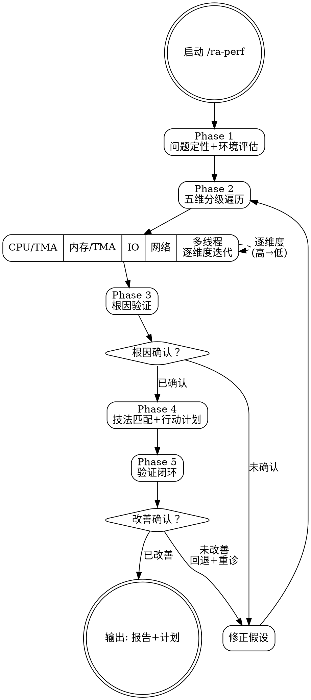

# ra-perf — 数据驱动性能优化

**刚性技能**: 严格遵循。观测→分析→假设→验证，禁止跳过任何步骤。

## Overview

强制执行数据驱动的性能优化工作流。外层五维遍历（CPU→内存→IO/磁盘→网络→多线程）确保不遗漏瓶颈，CPU 和内存维度内层使用 TMA（Top-down Microarchitecture Analysis）自顶向下下钻定位根因。环境自适应降级——工具不可用时自动切换替代方案。

**铁律**: 没有数据不优化，没有假设不实验，没有验证不结论。

## When to Use

- 用户报告性能问题（"程序慢"、"延迟高"、"吞吐低"）
- 需要系统性诊断和优化
- 有代码（可修改重编译）或无代码（仅可观测二进制）均可

**不适用**: 纯 Web 前端性能优化、Java/JVM GC 调优、K8s 配置问题（不确定是代码还是配置问题）。

## Core Process



### Phase 1: 问题定性 + 环境评估

**目标**: 将模糊的"程序慢"转化为可分析的结构化描述。

1. **问题定性** — 确定分析的提问方向
   - 什么操作慢？（启动？某个请求？批量处理？全部？）
   - 何时开始？（某个提交后？某个数据量后？一直慢？）
   - 有无量化数据？（耗时多少？吞吐多少？期望多少？）

2. **代码场景判断**
   - **有代码**: 可修改源码、重编译、使用编译器优化和插桩
   - **无代码**: 仅有二进制，依赖外部观测工具

3. **安全评估** — AI 必须在 Phase 1 输出中明确记录以下评估结果，若有任一答案为"是"，须向用户说明风险并等待确认
   - 是否为生产系统？→ 限制：禁止内核参数修改和 perf_event_paranoid 降级
   - 是否为多租户/共享环境？→ 限制：禁止可能泄露他人数据的采样工具
   - 目标进程是否处理敏感数据（密钥/PII/支付）？→ 限制：`perf record`/`strace`/`bpftrace` 需用户确认数据保护风险
   
4. **环境能力摸底** — 按降级链测试可用工具（**安全优先**：先尝试无需特权的选项）
   - CPU: `perf stat` → `top -b -n 1 + time -v` → 应用内打点
   - 内存: `perf stat -e cache-misses,cache-references` → `/usr/bin/time -v` → `top`
   - IO: `iostat` → `/proc/<pid>/io` → `strace -c`（⚠️ 高开销，非生产环境）
   - 网络: `sar -n DEV` → `netstat -s` → 应用内打点

   完整工具矩阵见: `references/perf/tools-reference.md`

**输出**: 结构化问题描述 + 安全约束清单 + 可用工具清单

### Phase 2: 五维分级遍历

**目标**: 依次检查五个维度，按可疑度排序，定位瓶颈维度。

1. **快速分级** — 对每个维度评估可疑度
   | 维度 | 快速信号 | 深入条件 |
   |------|---------|---------|
   | CPU | `top -b -n 1` 显示 CPU >80% | TMA L1→L2→L3 |
   | 内存 | Cache miss rate 高 / 内存增长 | TMA Memory Bound 下钻 |
   | IO/磁盘 | `iostat` await >10ms (SSD) / >30ms (HDD) / %util >70% | `strace` + `bpftrace` |
   | 网络 | TCP 重传 >0.1% / 队列积压 | `sar` + `bpftrace` |
   | 多线程 | 加速比 << 核心数 | perf lock + c2c |

2. **按可疑度（高→中→低）逐维度深入分析**

3. **CPU/内存维度 — TMA 自顶向下内层**
   ```
   Level 1: 确定瓶颈大类 (Frontend/BadSpec/Backend/Retiring)
     └── Backend Bound?
         Level 2: Core Bound vs Memory Bound
           └── Memory Bound?
               Level 3: L1/L2/L3/DRAM/DTLB
   ```
   详细技法见: `references/perf/cpu-optimization.md`、`references/perf/memory-optimization.md`

4. **IO/网络/磁盘维度 — 工具驱动分析**
   - 从可用的最高精度工具开始（bpftrace > strace > /proc）
   - 详细技法见对应 reference 文件

5. **多线程维度 — 专项诊断**
   - 锁竞争、伪共享、NUMA、扩展效率
   - 详细技法见: `references/perf/concurrency-optimization.md`

6. **交叉分析** — 警惕级联效应
   - IO 高 iowait → CPU 看似高但实际在等 IO
   - 内存带宽竞争 → 多线程扩展差

**输出**: 各维度分析结果 + 根因候选（含置信度）

### Phase 3: 根因验证

**目标**: 用实验证明假设，禁止凭直觉下结论。

1. 对候选根因设计对照实验
   - 微基准隔离: 写最小复现代码验证假设
   - 对比实验: A/B 测试（改前/改后、开/关某优化）
   - 工具交叉验证: 多个工具确认同一结论

2. 验证标准
   - 有代码: 修改代码 → 重新测试 → 确认改善
   - 无代码: 更换工具/角度 → 交叉验证 → 确认根因

3. 如果实验推翻了假设 → 回到 Phase 2 重新分析

**输出**: 确认的根因（含实验数据支撑，置信度 >80%）

### Phase 4: 技法匹配 + 行动计划

**目标**: 从参考文件中匹配最优优化手段，生成可执行的行动计划。

1. 根据确认的根因，检索对应 reference 文件
2. 评估候选技法:
   - **预期收益**: 大/中/小
   - **实施成本**: 低（改编译选项）/ 中（局部重构）/ 高（架构变更）
   - **风险**: 低（纯编译器优化）/ 中（局部代码修改）/ 高（改变语义）

3. 按 ROI 排序生成行动计划
   ```
   优先级 = 高收益 + 低成本 + 低风险  → 先做
   次优   = 高收益 + 中成本            → 次做
   最后   = 中收益 + 高成本            → 评估是否值得
   ```

**输出**: 分析报告（根因+数据+推理）+ 行动计划（优先级+预期收益+成本+风险）

### Phase 5: 验证闭环

**目标**: 确认优化真正有效，而非幻觉。

1. 在相同条件/输入下重新观测
2. 对比优化前后数据
3. 如未改善 → 分析原因、回退、重新诊断
4. 如已改善 → 记录 before/after 数据作为经验沉淀

**输出**: 改善确认报告（含 before/after 数据对比）

---

## References

本技能的设计理念来自两本书:
- "Performance Analysis and Tuning on Modern CPUs" (Denis Bakhvalov)
- "鲲鹏编程与调优指南" (华为)

按需加载以下参考文件（不在 SKILL.md 中内联，避免上下文膨胀）:
> 所有参考路径相对于仓库根目录 `<repo>/reliable-agent/`。使用时需解析为绝对路径。

| 文件 | 内容 | 读取条件 |
|------|------|---------|
| `references/perf/cpu-optimization.md` | CPU 优化技法（TMA、编译器、SIMD） | CPU 为高可疑维度 |
| `references/perf/memory-optimization.md` | 内存/Cache 优化技法 | 内存为高可疑维度 |
| `references/perf/io-optimization.md` | IO/磁盘优化技法 | IO 为高可疑维度 |
| `references/perf/network-optimization.md` | 网络优化技法 | 网络为高可疑维度 |
| `references/perf/concurrency-optimization.md` | 多线程/并发优化技法 | 多线程为高可疑维度 |
| `references/perf/tools-reference.md` | 观测工具速查 + 环境降级链 | Phase 1 环境评估阶段 |
| `references/perf/case-studies.md` | 典型优化案例 | 需要启发式参考时 |
| `references/performance-checklist.md` | 通用性能检查清单（数据访问、算法、IO 模式） | Phase 2 快速分级 或 Phase 4 交叉验证 |

---

## Common Rationalizations

| 借口 | 现实 |
|------|------|
| "这个改动显然会加速" | 如果没观测，你不知道。直觉在性能领域通常不可靠。 |
| "换这个算法一定快" | 算法复杂度不决定实际性能。Cache 行为往往主导。 |
| "编译器会自动优化" | 编译器不总是能优化——别名问题、复杂循环、跨文件调用都可能阻止优化。 |
| "先试几个优化看看哪个有用" | 盲目试错在最坏情况下引入新问题而不自知。数据驱动，一次一个假设。 |
| "我的机器上很快" | 生产环境的硬件/数据量/并发量可能完全不同。 |
| "加点线程就好了" | 多线程可能引入锁竞争和伪共享，反而更慢。 |
| "优化到一半就够了，不需要验证" | 无验证的优化是"似乎正确"——你不知道是真有效还是测量噪声。 |
| "我需要 root 才能做性能分析" | `perf stat`、`/proc` 文件系统、`iostat` 等大量工具无需 root。先尝试这些。 |

## Red Flags

- 无观测数据就提出优化方案
- 跳过 Phase 3 根因验证直接写代码
- 一次修改多个优化变量（无法归因）
- 没有 before/after 对比
- 在没有 perf stat 数据的情况下断定"CPU 瓶颈"
- 在没有 iostat 数据的情况下断定"IO 瓶颈"
- 用 `printf` + 墙钟时间作为唯一测量手段（精度差、噪声大）

## Verification

- [ ] Phase 1: 问题已结构化描述，安全评估已完成（生产系统？敏感数据？），环境能力已摸底
- [ ] Phase 2: 五个维度可疑度已分级，高可疑维度已深入分析
- [ ] Phase 3: 根因有实验数据支撑，置信度 >80%
- [ ] Phase 4: 分析报告完整，行动计划含优先级+收益+成本+风险+回退方案
- [ ] Phase 5: before/after 数据对比，改善确认或回退
- [ ] 内核参数修改已记录当前值和恢复命令
- [ ] 整个过程中没有凭直觉跳步，没有未经确认的安全降级

<HARD-GATE>
**数据纪律:**
在没有观测数据的情况下，禁止提出任何优化方案。
每个优化建议必须附带对应的观测数据（perf stat / iostat / 采样 / 其他工具输出）。
环境工具不可用时，必须先降级尝试，记录降级路径，再继续分析。
禁止一次修改多个变量——每次实验只改变一个因素。

**安全纪律:**
禁止在未经用户明确确认的情况下修改内核参数（sysctl -w / /proc/sys/ / /sys/）。
禁止在未经用户明确确认的情况下降低系统安全设置（perf_event_paranoid 等）。
内核参数修改前必须：记录当前值 → 描述变更风险 → 提供恢复命令。
行动计划中的每项内核/系统级修改必须附带恢复（回退）命令。
生产系统/多租户环境禁止试验性内核参数修改。
</HARD-GATE>

## 下一步指引

**推荐路径**:
- 行动计划中的优化任务 → `/ra-build`（有代码修改时）
- 需要审查优化代码 → `/ra-request-review`
- 性能改善后的经验沉淀 → `/ra-evolve`

**其他选项**:
- 如需生成完整性能报告 → 在 Phase 4 产出后人工审阅
- 如需进一步分析其他维度 → 重新进入 `/ra-perf` Phase 2
