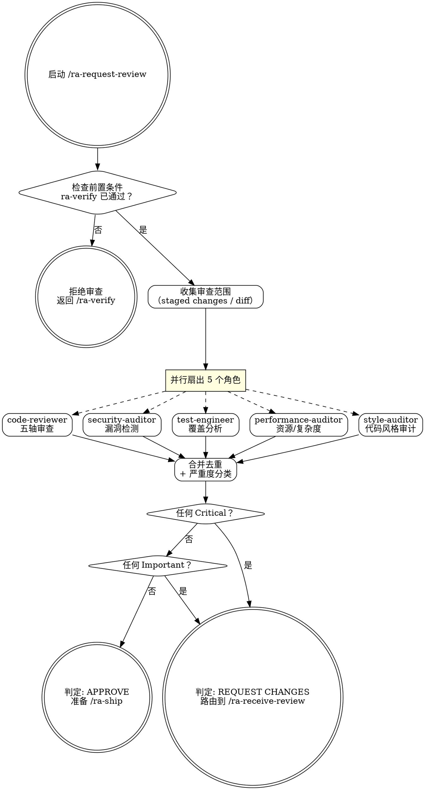

# ra-request-review — 多角度代码审查

**刚性技能**: 严格遵循。不要偏离纪律。

## Overview

运行 5 个专业审查角色的并行扇出，每个角色从不同维度审查代码。综合发现、去重、按严重度分类，生成结构化审查报告。这是 G3 门禁的实施者。

**核心理念**: 不同专业领域捕捉不同问题。一个审查者看到的东西另一个可能完全错过。风格合规性由 style-auditor 专门审计。

## When to Use

- ra-verify 通过后
- 代码需要合并前审查
- PR 提交前自审查

**前置条件**: ra-verify 必须已通过（G1/G2）。如果未通过，拒绝审查。

## Core Process

### Step 1: 前置检查
- 确认 ra-verify 已通过
- 如果未通过：拒绝审查——"G2 未满足：ra-verify 必须在审查前通过。先运行 /ra-verify。"
- 完成标准: G1/G2 已确认通过

### Step 2: 收集审查范围
- 识别 staged changes 或最近的 commits
- 确定 diff 范围
- 完成标准: 审查范围已确定

### Step 3: 并行扇出（单轮，所有 Agent 调用同时）
- **reliable-agent:code-reviewer**: 五轴审查（正确性、可读性、架构、安全性、性能）
- **reliable-agent:security-auditor**: OWASP Top 10 + 密钥处理 + auth/authz + 依赖 CVE + 输入验证 + AI/LLM 特性
- **reliable-agent:test-engineer**: 覆盖分析——正常路径、边界、错误、并发、缺失断言
- **reliable-agent:performance-auditor**: N+1 查询、无限操作、内存模式、算法复杂度、资源使用
	- **reliable-agent:style-auditor**: 代码风格审计——定位 `.reliable-agent/codestyle/` 规范文件 → 对照声明规则审计命名、格式、导入、注释、文件组织 → 违反声明规则 = Important（阻塞合并），无声明规则 = Suggestion，无规范文件 = Skip

### Step 4: 合并与分类
参照 `references/severity-normalization.md` 将各 Agent 的特定领域严重度映射为统一分类：
- 角色间去重（同一发现被多 Agent 报告时取最严重统一级别）
- 每条发现映射到统一严重度（见 `references/severity-normalization.md` 映射表）：
  - **Critical**: 安全漏洞、数据丢失、功能损坏、声明规则违反——阻塞合并
  - **Important**: 缺少测试、错误抽象、糟糕的错误处理——合并前修复
  - **Suggestion**: 命名、风格观察（无声明规则时）、可选优化——评估后决定
- 每条发现含: file:line、描述、影响、修复建议、原始 Agent 和级别
- 完成标准: 所有发现已去重和按统一严重度分类

### Step 5: 输出审查报告
包含：
- Verdict: APPROVE / REQUEST CHANGES
- Critical 发现（阻塞项）
- Important 发现（应该修复）
- Suggestions（考虑改进）
- What's Done Well（至少一条正面观察）
- Verification Story（测试审查、构建验证、安全检查）

<HARD-GATE>
如果任何 Critical 发现存在，判定为 REQUEST CHANGES。在所有 Critical 解决之前不要进入 ra-ship。
</HARD-GATE>

## Common Rationalizations

| 借口 | 现实 |
|------|------|
| "这个变更很小，一个审查者就够了" | 不同专业领域捕捉不同问题。安全审计员看到代码审查者看不到的东西。风格审计员捕捉命名和格式的不一致。 |
| "只用 code-reviewer，跳掉其他的" | 安全、测试覆盖、性能和风格不是可选审查维度。它们是标准。 |
| "我自己就可以审查" | 自审查有盲点——进入代码的同样假设也进入了审查。 |

## Red Flags

- 串行而非并行运行审查者
- 审查角色试图调用另一个角色（违反角色隔离）
- 跳过合并去重阶段
- 发现无 file:line 引用
- 不解决 Critical 发现就批准

## Verification

- [ ] ra-verify 已通过（在开始前确认）
- [ ] 5 个角色并行运行（单轮派发）
- [ ] 每个角色返回了结构化报告
- [ ] 发现已去重和按严重度分类
- [ ] 每条 Critical/Important 发现含 file:line + 建议
- [ ] 至少一条正面观察
- [ ] 审查报告已保存并展示给用户

## 下一步指引

**推荐路径** → `/ra-receive-review` — 处理审查报告中的发现：修复 Critical，评估 Important，记录 Suggestion

**其他选项**:
- 等待外部（人类）审查者反馈后再执行 `/ra-receive-review`
