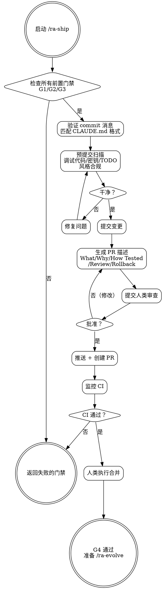

# ra-ship — 提交与发布

**刚性技能**: 严格遵循。人类批准后才能推送。

## Overview

最终的发布门禁。验证所有前置门禁、校验 commit 格式、生成完整 PR 描述、等待人类批准后推送和合并。这是 G4 门禁的实施者。

**铁律**: 未经人类明确说"创建 PR"或等效指令，绝不推送或创建 PR。

## When to Use

- 所有前置门禁通过后
- 变更准备合并
- 准备提交和创建 PR

**前置条件**: ra-verify (G1/G2) + ra-request-review (G3)。

## Core Process

### Step 1: 门禁检查
验证所有前置门禁：
- G1/G2: ra-verify 已通过
- G3: 所有 Critical 已修复，Optional 已记录
- 如果任何门禁未满足→返回失败的门禁
- 读取 `.reliable-agent/experiences.md`（集中式，如存在）和 `.reliable-agent/ra-ship/experiences.md`（技能专属）中相关经验
- 完成标准: 所有前置门禁已确认

### Step 2: Commit 格式校验
- 按 CLAUDE.md 格式草拟提交消息
- 校验每条消息匹配格式（正则/模板）
- 确保原子提交（一个关注点一个提交）
- 展示提交供人类审查
- 完成标准: 提交消息格式正确

### Step 3: 预提交扫描
检查：
- 无遗留调试代码（console.log, debugger）
- 无不带 Issue 引用的 TODO
- 无被注释掉的代码
- 无暂存文件中的密钥或令牌
- 如 `.reliable-agent/codestyle/` 存在，验证变更文件符合声明规范
- 完成标准: 预提交扫描清洁

### Step 4: 提交
- 用校验过的消息执行提交
- 完成标准: 变更已提交

### Step 5: 生成 PR 描述
包含：
- **What**: 做了什么变更
- **Why**: 为什么需要
- **How Tested**: 如何验证的
- **Review Summary**: 审查结果摘要
- **Rollback Plan**: 如何回滚
- 链接 spec、plan 和 review report
- 引用相关 issues
- 完成标准: PR 描述完整

### Step 6: 人类审查
- 展示 PR 草稿
- **未经人类说"创建 PR"绝不推送**
- 完成标准: 人类明确批准

### Step 7: 创建并推送 PR
- 推送分支
- 在远程创建 PR
- 完成标准: PR 已创建

### Step 8: 监控 CI
- 等待 CI 完成
- 如果 CI 失败→返回 ra-build
- 完成标准: CI 通过

### Step 9: 人类合并
- 按 CLAUDE.md 指定的策略合并
- 完成标准: 合并完成

<HARD-GATE>
未经人类明确批准，绝不创建 PR 或推送。
所有 CI 检查通过前绝不合并不。
如果任何 Critical 审查发现仍未解决，绝不发布。
未经预提交扫描绝不出任何代码。
</HARD-GATE>

## Common Rationalizations

| 借口 | 现实 |
|------|------|
| "直接推送就行不用 PR" | PR 是审计追踪。它们将代码变更链接到讨论、审查和决策。 |
| "commit 消息不用完全匹配格式" | 格式一致性使自动化 changelog 和大规模 git log 可读。 |
| "预提交扫描可以跳过，我知道我提交了什么" | 人类不擅于在 diff 中注意密钥。扫描捉住你漏掉的东西。 |
| "周五下午了，快点发布" | 部署风险在周五下午升高。耐心对待门禁。 |

## Red Flags

- 未经人类审查推送提交
- commit 消息不匹配 CLAUDE.md 格式
- PR 描述缺少 Why 或 How Tested
- 未通过所有门禁就发布
- "周五下午紧急发布"

## Verification

- [ ] 所有前置门禁已通过（verify, log, review）
- [ ] commit 消息验证匹配 CLAUDE.md 格式
- [ ] 预提交扫描未发现调试代码、无 Issue TODO 或密钥；风格合规已检查
- [ ] 提交是原子的（一个关注点一个提交）
- [ ] PR 描述完整（What/Why/How Tested/Review Summary/Rollback Plan）
- [ ] 人类在推送前批准了提交和 PR
- [ ] CI 在 PR 分支上通过
- [ ] G4: commit 格式符合规范
- [ ] 合并成功完成

## 下一步指引

**推荐路径** → `/ra-evolve` — 发布完成，回顾本次 session、提取经验教训并分析进化建议
