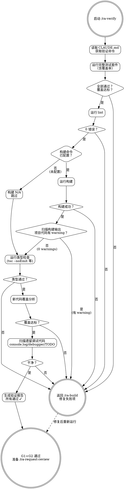

# ra-verify — 自动化验证

**刚性技能**: 严格遵循。不要偏离纪律。

## Overview

运行项目的所有自动化验证：测试、lint、构建、类型检查。这是 G1/G2 质量门禁的实施者——任何一项失败则阻塞进入审查。

**铁律**: 如果任何检查失败，STOP。返回 ra-build。在所有检查全绿之前不要进入审查。

## When to Use

- ra-build 阶段完成后
- 需要确认代码审查就绪
- 修复审查反馈后重新验证

## Core Process

### Step 1: 读取验证命令
- 从 CLAUDE.md 获取确切的验证命令
- 完成标准: 已确认所有命令

### Step 2: 运行测试套件
- 执行 CLAUDE.md 中的测试命令（含覆盖率 flag）
- 捕获输出
- 覆盖率必须满足 CLAUDE.md 中定义的阈值
- 完成标准: 所有测试通过，覆盖率达标

### Step 3: 运行 lint
- 执行 lint 命令
- 零错误（零警告——如果策略规定）
- 完成标准: lint 清洁

### Step 3a: 风格规范检查（如 codestyle/ 存在）
- 检查 `.reliable-agent/codestyle/` 是否存在
- 如存在，对照声明规范检查变更文件的风格合规性
- 此步骤提供信息性报告，不阻塞 G1/G2
- 严重违规将标记为供 style-auditor 在审查阶段处理
- 完成标准: 风格检查已完成（或跳过——无规范文件时）

### Step 4: 构建步骤适用性检查

- 检查 CLAUDE.md 中是否定义了构建命令
- CLAUDE.md 中可通过 `verify.build.enabled: false` 显式声明无构建步骤
- 若无构建命令且未显式声明 → 视为 N/A，跳过 Step 4-4c，直接进入 Step 5
- 完成标准: 构建适用性已判定

### Step 4a: 运行构建

- 执行 CLAUDE.md 中定义的构建命令
- 设置 `LC_ALL=C` 确保编译器输出为英文（warning 检测依赖英文关键词）
- 捕获 stdout + stderr（保留完整输出用于后续扫描）
- 零错误（exit code = 0）
- 完成标准: 构建成功

### Step 4b: 编译器警告扫描与判定

- 扫描构建输出中的 compiler warning 信息
- 匹配策略——使用统一的组合正则一次扫描完成:
  - GCC/Clang: `file:line:col: warning: message [-Wflag-name]`
  - TypeScript: `file(line,col): warning TS####: message`
  - Rust: `warning[E####]: message` → `file:line:col`
  - MSVC: `file(line): warning C####: message`
  - Go vet: `file:line:col: message`
  - 通用 fallback: 行中含 `warning` 且存在类文件路径模式
- **多行 warning 注意**: GCC caret diagnostics、MSVC 多行输出等可能被漏检。如构建输出存在疑似多行 warning，应手动审查完整输出后再确认结果
- 完成标准: 构建输出已完整扫描

### Step 4c: 路径过滤

- 仅标记**项目工作区内源文件**产生的 warning
- 自动排除路径（默认过滤列表）:
  - `node_modules/`
  - `vendor/`
  - `*.d.ts`（TypeScript 声明文件）
  - `/usr/include/`、`/usr/local/include/`
  - `third_party/`、`thirdparty/`
  - `.venv/`、`venv/`、`virtualenv/`
  - `__pycache__/`
  - `build/`、`dist/`、`target/`、`out/`（构建产物目录）
  - `cmake-build-*/`、`bazel-*/`（构建系统输出目录）
  - 以 `.git/` 开头的路径
  - 系统库路径（`/lib/`、`/lib64/`、`/System/Library/`）
- 可通过 CLAUDE.md 中的 `verify.build.warningExcludes` 追加额外排除模式
- **防护**: 禁止将项目源目录（如 `src/`、`lib/`、`app/`）添加到 `warningExcludes`
- 完成标准: 警告已过滤，仅保留项目代码相关的 warning

### Step 4d: 白名单过滤

- 应用 CLAUDE.md 中 `verify.build.warningAllowlist` 定义的豁免规则
- 白名单条目为**结构化格式**，每个条目包含:
  - `file` (glob): 适用文件范围
  - `warningCode` (string): 具体警告代码（如 `-Wdeprecated-declarations`、`TS6133`）
  - `reason` (string): 豁免理由，必须引用跟踪 issue
  - `expires` (date 或 `"permanent"`): 过期日期，过期条目自动失效
- 同时匹配 `file` 和 `warningCode` 才豁免——防止宽泛匹配绕过门禁
- 匹配白名单的 warning 不阻塞验证，但在报告中标明 "whitelisted" 及匹配的豁免规则
- **防护**: 审查者应检查白名单条目是否过于宽泛（禁止 `file: ".*"` 等通配全部的模式）
- 完成标准: 白名单已应用，剩余 warning 均为未豁免项

### Step 4e: 编译器警告判定

- 若过滤后 warning 数 > 0 → **FAIL**（阻塞 G2 门禁）
- 若过滤后 warning 数 = 0 → **PASS**，继续 Step 5
- 完成标准: 编译器警告检测完成

### Step 5: 类型检查
- TypeScript: `npx tsc --noEmit`
- 其他类型语言：等效命令
- 完成标准: 无类型错误

### Step 6: 新代码覆盖检查
- 检查变更区域有对应测试
- 如果覆盖在变更区域下降→标记为 FAIL
- 完成标准: 新代码覆盖满足 CLAUDE.md 阈值

### Step 7: 遗留调试代码扫描
- 搜索: `console.log`, `debugger`, 不带 Issue ID 的 `TODO`
- 标记发现
- 完成标准: 无遗留调试代码

### Step 8: 生成验证报告
- 每类 pass/fail
- 具体失败位置 file:line
- 覆盖摘要（整体 + 变更文件）
- lint 错误数
- 构建状态
- 完成标准: 报告已生成

<HARD-GATE>
如果以下任一项成立，STOP。不要进入 ra-request-review：
- 任何测试失败
- lint 错误数 > 0
- 构建失败
- 编译器警告数 > 0（排除白名单项后，仅项目代码范围内的 warning）
- 类型检查失败
- 新代码覆盖率低于 CLAUDE.md 阈值
- 存在未豁免的遗留调试代码

返回 ra-build 修复失败项。在所有检查全绿之前不要进入审查。
</HARD-GATE>

## Common Rationalizations

| 借口 | 现实 |
|------|------|
| "只是一个 lint 警告" | 今天的警告是明天被忽略的错误。零容忍是策略。 |
| "测试失败是 flaky 的，我机器上过了" | Flaky 测试就是失败测试。在继续之前修复 flakiness。 |
| "覆盖率接近阈值了" | 阈值存在是因为低于它你不能信任测试套件。"接近"就是低于。 |
| "这只是一个文档变更，不需要完整验证" | 文档变更不会破坏构建——验证成本微不足道但保证一致性。 |
| "这只是一个编译警告，不影响运行" | 编译器警告今天不修复，明天就是线上 bug。警告是未来的错误。零警告是不可妥协的工程纪律。 |
| "这个 warning 在第三方依赖中，我修不了" | 正确——ra-verify 的路径过滤会自动排除第三方代码的 warning。但项目代码的 warning 必须修复。 |
| "我已经用了 -Werror，不需要再扫描" | `-Werror` 能在编译时拦截，推荐使用。但 ra-verify 的输出扫描是安全网——构建系统可能吞掉某些 warning（如 `make -s` 静默模式隐藏输出，`ninja` 单行进度覆盖 warning）。双重保险。 |
| "构建都失败了，warning 扫不扫无所谓" | 构建失败时 ra-verify 不扫描 warning（构建错误可能产生级联伪 warning）。但修复构建错误后第一次扫描时发现 warning 会让你再跑一轮。建议修构建错误时同步扫一眼输出中的 warning，一次修完。 |

## Red Flags

- 运行验证命令但尽管失败仍继续
- "我在本地跑过了，不用再跑一遍"
- 跳过新代码覆盖分析
- 未读取 CLAUDE.md 的验证命令
- 构建输出中有 warning 但声称 "没事，只是 warning"
- 手动忽略编译器警告而不记录豁免理由
- `warningExcludes` 中包含项目源目录（如 `src/`、`lib/`、`app/`）——这会系统性隐藏项目代码 warning
- `warningAllowlist` 中使用 `.*` 或 `*` 等通配全部条目的模式——这会完全绕过 G2 门禁
- 白名单条目已过期但未清理——过期的豁免规则可能掩盖新的 warning

## Verification

- [ ] CLAUDE.md 中的所有验证命令已执行
- [ ] 构建适用性已判定（N/A 则跳过构建相关检查）
- [ ] 完整测试套件: 100% 通过
- [ ] Lint: 0 错误
- [ ] 风格检查完成（如 `.reliable-agent/codestyle/` 存在）
- [ ] 构建: 成功（exit code = 0，LC_ALL=C 环境）
- [ ] 编译器警告扫描: 已执行（构建输出已完整扫描）
- [ ] 路径过滤已应用: 仅项目代码范围内的 warning 被标记（第三方/构建产物路径已排除）
- [ ] 白名单已应用: 豁免项已标记为 "whitelisted"，不计入阻塞计数
- [ ] 编译器警告（项目代码）: 0（排除白名单项后）
- [ ] 类型检查: 成功
- [ ] 新代码覆盖满足 CLAUDE.md 阈值
- [ ] 无遗留调试代码
- [ ] 验证报告已生成（含 compiler warnings 计数 + 白名单豁免明细）并附在 session 中

## 下一步指引

**全部通过时**:
- `/ra-log` — 检查可观测性（日志/指标/追踪）是否到位
- 或直接 `/ra-request-review` — 跳过可观测性，直接提交 5-agent 并行审查
- `/ra-auto` — 自动接管后续流程（审查→修复→验证→文档），一站式完成

**有失败项时**:
- `/ra-build` — 返回修复测试失败、lint 错误或构建问题，修复后重新验证
