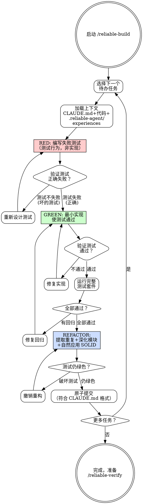

# Reliable Build — TDD 增量实现

**刚性技能**: 严格遵循。不要偏离纪律。

## Overview

严格的 TDD 增量实现——一次一个垂直切片。先写失败的测试，再写最小实现使其通过，然后重构。绝不跳过 RED、绝不在 RED 时重构、绝不在 GREEN 前提交。

**铁律**: 没有失败的测试，就不写生产代码。

## When to Use

- 从方案中实现代码
- 修复 bug
- 添加功能
- 重构（先确保测试覆盖）

**不适用**: 仅文档变更、仅配置变更（直接进入 reliable-verify）。

## Core Process

### Step 1: 选择下一个任务
- 从 `.reliable-agent/plans/*-plan.md` 中选取下一个待办任务
- 遵守依赖顺序
- 完成标准: 已选择任务，其依赖已满足

### Step 2: 加载上下文
- 读取任务验收标准
- 加载相关已有代码、CLAUDE.md 中的模式
- 检查 `.reliable-agent/experiences.md` 中相关经验
- 完成标准: 已理解任务和相关代码上下文

### Step 3: RED — 编写失败测试
- 写**恰好一个**测试描述预期行为
- 测试必须通过公共接口（重构不破坏测试）
- 测试名读起来像规格说明："为国际订单计算运费"
- 运行测试——**确认失败**（证明测试检测到缺失行为）
- 如果测试在没有实现的情况下通过→重新思考测试
- **前导词**: 测试必须是 **red-capable**（能检测缺失行为）和 **tight**（快速、确定性、agent 可运行）
- 完成标准: 一个测试失败且失败原因是"行为不存在"

### Step 4: GREEN — 最小实现
- 写**最小**代码使测试通过
- 无投机功能（"以后可能用到"）
- 无超出测试范围的功能
- 如果实现超过 ~50 行测试还没通过→你做太多了
- 运行测试——确认通过
- 完成标准: 测试通过，代码是最小必要量

### Step 5: Verify — 运行完整套件
- 运行**完整**测试套件
- 运行构建验证编译
- 如有回归→修复回归再继续
- 完成标准: 全部测试通过，构建成功

### Step 6: REFACTOR — 清理（仅 GREEN 时）
- 仅 GREEN 时重构（**绝不在 RED 时重构**）
- 提取出现 >= 2 次的重复（不"可能重复"）
- 深化模块：将复杂性移到简单接口背后
- 自然应用 SOLID，非教条
- 按 `.reliable-agent/codestyle/` 中的规范格式化代码（如存在）
- 每次重构后运行测试
- 测试破坏→撤销重构
- 完成标准: 代码更简洁，测试全绿，风格合规

### Step 7: Commit — 原子提交
- 仅暂存此任务涉及的文件
- 按 CLAUDE.md 格式写提交消息
- 提交
- 一个任务一个提交
- 完成标准: 提交完成，消息符合格式

<HARD-GATE>
绝不在 RED 时重构。
绝不在 GREEN 前提交。
绝不跳过 Verify 步骤（完整套件+构建）。
每个切片不超过 ~100 行变更。
</HARD-GATE>

## Common Rationalizations

| 借口 | 现实 |
|------|------|
| "这个测试太简单不值得写" | 简单测试捕捉回归。写作成本可以忽略；回归发生时没有它代价巨大。 |
| "我先把所有测试写好再实现" | 水平切片产生想象的测试，非现实的。垂直切片保持测试与真实行为关联。 |
| "重构可以等做完功能再说" | 技术债务复利比你想的快。趁代码在脑子里新鲜时重构。 |
| "顺便把这个功能也加上吧" | 范围纪律。那个功能没有失败测试、验收标准或任务。它不属于这里。 |
| "实现很简单，看一眼就知道对了" | 你能看一眼知道对了≠三个月后的你能知道。测试是执行的规格。 |

## Red Flags

- 一次写多个测试再实现
- 实现超出当前测试需要的内容
- 在 RED 阶段重构
- 跳过完整套件运行
- 提交消息不符合 CLAUDE.md 格式
- 超过 100 行未运行测试
- 在同一次提交中混合重构和功能代码

## Verification

### Per Cycle
- [ ] 测试通过公共接口描述行为
- [ ] 测试实现了（RED）→实现前失败
- [ ] 实现是最小化的——无投机代码
- [ ] 完整测试套件通过（无回归）
- [ ] 构建成功
- [ ] 重构仅在 GREEN 时，重构后测试仍绿色
- [ ] 代码符合 `.reliable-agent/codestyle/` 中的声明规范（如存在）
- [ ] 提交消息遵循 CLAUDE.md 格式
- [ ] 任务在方案中标记为完成

## 下一步指引

**推荐路径** → `/reliable-verify` — 实现完成，运行完整验证（测试+lint+构建+风格）确认正确性

**其他选项**:
- `/reliable-build` — 继续实现方案中标记为未完成的下一个任务切片
