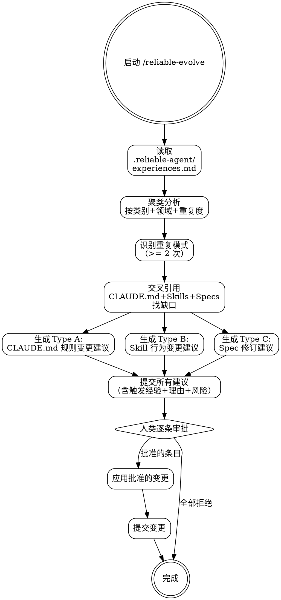

# Reliable Evolve — 经验驱动的进化

**灵活技能**: 根据上下文调整原则。

## Overview

这是三层进化模型的核心引擎。读取 `.reliable-agent/experiences.md` 中的结构化经验，通过聚类分析识别重复模式，生成三类变更建议。**所有建议不经人类批准绝不自动应用。**

**核心理念**: 进化不是自动的。AI 可以做模式识别和建议生成，但改变行为的决定权在人类。

## When to Use

- 积累多条 reliable-session-retro 经验后（建议 >= 3 条新经验）
- 周期性（例如每个 sprint 结束时）
- 重复问题出现在多次 code review 中
- 用户主动要求分析项目经验

## Core Process

### Step 1: 加载经验
- 读取 `.reliable-agent/experiences.md`
- 收集所有经验记录
- 完成标准: 所有经验已加载

### Step 2: 聚类分析
按以下维度分组：
- 类别: error-pattern, optimization-discovery, review-recurrence, workflow-friction, security-finding, process-win
- 领域: 代码库或工作流的哪部分
- 重复度: 相同根因出现 >= 2 次
- 完成标准: 经验已聚类，重复模式已识别

### Step 3: 识别缺口
将重复经验与以下交叉引用：
- CLAUDE.md 边界规则: 重复是否暗示缺少 Always/Never/Ask First？
- Skill 定义: 重复是否暗示某个 skill 步骤缺失或薄弱？
- Specs: 重复是否暗示架构模式需要更新？
- 完成标准: 缺口已识别

### Step 4: 生成 Type A — CLAUDE.md 规则建议
- 新的边界规则
- 变更的代码规范
- 更新的安全或性能基线
- 每条建议包含: 触发经验、确切规则文字、理由、应用风险
- 完成标准: Type A 建议已生成

### Step 5: 生成 Type B — Skill 变更建议
- 新增 skill 步骤
- 修改的验证检查清单
- 额外的借口反驳条目
- 变更的门禁条件
- 每条建议包含: 触发经验、确切变更 diff、理由、对流程的影响
- 完成标准: Type B 建议已生成

### Step 6: 生成 Type C — Spec 修订建议
- 架构模式变更
- API 合约更新
- 数据模型修订
- 每条建议包含: 触发经验、确切变更、理由、迁移影响
- 完成标准: Type C 建议已生成

### Step 7: 提交建议
- 所有建议按类型组织的结构化输出
- 每条包含: 触发经验、变更内容、理由、风险
- 完成标准: 建议列表已展示

### Step 8: 人类审批
- **逐条审批，不批量**
- 批准后: 仅应用批准的变更
- 拒绝: 记录拒绝不应用
- 完成标准: 所有建议已有审批决定

<HARD-GATE>
绝不自动应用任何建议——全部需人类明确批准。
拒绝的建议记录但不应用。
批准的变更逐一提交，不混合在一次提交中。
</HARD-GATE>

## Common Rationalizations

| 借口 | 现实 |
|------|------|
| "这个经验只发生过一次，不需要进化" | 一次严重事件就够了。重复阈值存在是为了置信度，不是必需性。 |
| "让我自动应用这些改进" | 进化改变代理行为。人类审查是非预期后果的安全机制。 |
| "改动很小，直接应用就行" | 小改动在聚合时可能有重大影响。每条建议独立审查。 |

## Red Flags

- 未人类批准就应用建议
- 生成建议但不链接到具体经验记录
- 建议移除已有的安全检查
- 为未实际发生的问题生成建议

## Verification

- [ ] .reliable-agent/experiences.md 已读取且所有经验已编录
- [ ] 重复模式（>= 2 次）已识别
- [ ] 每条建议链接到具体触发经验
- [ ] 每条建议包含: 触发、确切变更文字、理由、风险
- [ ] 未经人类批准未自动应用任何建议
- [ ] 批准的建议逐一提交
- [ ] 应用的 CLAUDE.md 变更通过 reliable-spec 验证

## 下一步指引

**推荐路径** → `/reliable-update-doc` — 经验已提取，同步更新项目文档

**其他选项**:
- `/reliable-build` — 立即实现人类已批准的进化建议
