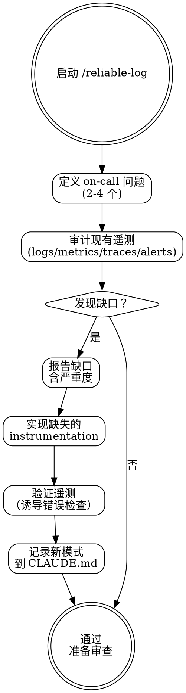

# Reliable Log — 可观测性检查

## Overview

基于 on-call 问题驱动的方法审计和补充可观测性。每条遥测信号应回答一个值班工程师在凌晨 3 点会问的问题。此技能确保"不能诊断的 bug 总是在没有遥测的功能上"这一教训不会在本项目重演。

**核心理念**: 随构建一起添加可观测性——不是事后补救。

## When to Use

- build+verify 阶段完成后
- 需要确保新代码在生产环境可诊断
- 添加新端点/功能/外部调用后

## Core Process

### Step 1: 定义 On-Call 问题
写下值班工程师关于此功能的 2-4 个问题：
- "此功能正常工作吗？"
- "如果坏了，哪里坏了？"
- "有多少用户受影响？"
- "最近的变更是否引入了退化？"
- 完成标准: 每个后续信号映射到一个 on-call 问题

### Step 2: 审计现有遥测
对照 `references/observable-patterns.md` 检查：
- **结构化日志**: JSON 事件、稳定事件名、关联 ID、无密钥/PII
- **RED 指标**: 新端点的 Rate/Errors/Duration，延迟直方图，受控标签
- **追踪**: OpenTelemetry spans、跨异步边界传播
- **告警**: 基于症状、runbook 链接、页面 vs 通知严重度
- 完成标准: 审计完成，缺口已识别

### Step 3: 报告缺口
对每个缺失信号：
- 从当前遥测中无法回答什么
- 什么信号类型能回答（log/metric/trace/alert）
- 严重度: critical（生产盲点）/ important（诊断缺口）/ notable（改进机会）
- 完成标准: 缺口列表含严重度

### Step 4: 实现缺失的 Instrumentation
- 添加结构化日志事件
- 添加 RED 指标
- 添加追踪 spans
- 定义告警
- 遵循 `references/observable-patterns.md` 中的模式
- 完成标准: 所有 critical 和 important 缺口已补全

### Step 5: 验证遥测
- 在 staging/测试中诱导一个错误
- 确认结构化日志中出现正确的字段和关联 ID
- 确认新指标系列出现
- 确认追踪 spans 连接
- 完成标准: 遥测端到端可工作

### Step 6: 记录
- 如果确立了新的遥测模式，更新 CLAUDE.md 的可观测性部分
- 完成标准: 新模式已记录（如适用）

## Common Rationalizations

| 借口 | 现实 |
|------|------|
| "这个功能太小，可观测性是过度设计" | 你无法诊断的 bug 总是在没有遥测的功能上。功能大小 ≠ 诊断难度。 |
| "出第一次事故后再加日志" | 第一次事故是发现你完全盲目的最昂贵时刻。代码新鲜时添加。 |
| "console.log 够好了" | 非结构化输出无法过滤、关联或告警。结构化 JSON 多花 5 分钟一次性。 |
| "监控是 SRE 的事" | SRE 不了解你的代码逻辑。你需要告诉他们看什么。 |

## Red Flags

- 新端点无 RED 指标
- 字符串插值而非结构化 JSON 的日志行
- 无关联/请求 ID 传播
- 指标标签含用户 ID、原始 URL 或错误消息文本
- 延迟按平均值追踪无百分位
- 日志输出中含密钥、令牌或完整请求体

## Verification

- [ ] On-call 问题已写出，每个信号映射到一个
- [ ] 所有新日志输出是结构化 JSON，含稳定事件名
- [ ] 关联 ID 在所有日志行和 spans 中传播
- [ ] 日志行中无密钥或 PII
- [ ] 每个新端点和外部依赖 RED 指标存在
- [ ] 延迟使用直方图（P95/P99 可查询）
- [ ] 新告警基于症状且有 runbook 链接
- [ ] 在 staging 中诱导的失败可通过遥测单独定位

## 下一步指引

**推荐路径** → `/reliable-request-review` — 可观测性已就绪，将代码提交多方（5-agent 并行）审查
