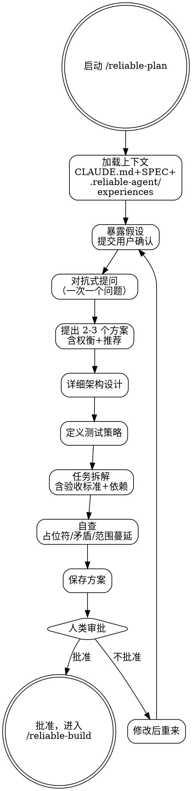

# Reliable Plan — 需求分析与方案设计

## Overview

通过对抗式提问（grill-me）压力测试需求，然后将验证后的需求转化为包含任务拆解的详细实现方案。此技能是"想清楚再动手"的强制实践——10 分钟的 grill 可防止数小时的错误路径实现。

**核心理念**: 未经对抗测试的理解留下盲点，盲点变成返工。

## When to Use

- 有需求/规范，需要创建实现方案
- 用户给出了大致方向但需要细化
- 需要将模糊想法转化为可执行任务

**不适用**: 纯文档变更、单行 bug 修复（直接进入 reliable-build）。

## Core Process

### Step 1: 加载上下文
- 读取 CLAUDE.md（项目宪法）
- 读取 SPEC.md（如存在）
- 读取 `.reliable-agent/experiences.md`（如存在）——检查过往相关经验
- 搜索项目中类似的过往工作
- 完成标准: 已确认所有相关上下文已加载

### Step 2: 暴露假设
- 列出所有对需求、架构、范围、约束的假设
- 用 `我正在做的假设：` 格式提交用户
- 让用户纠正错误假设
- 完成标准: 用户确认或纠正了所有假设

### Step 3: Grill-Me — 对抗式提问
**一次一个问题，等待用户反馈后才问下一个。** 覆盖：
- **边界情况**: null/empty/零值/并发/过载场景
- **失败模式**: 网络断/超时/部分成功/数据损坏
- **一致性**: 需求之间有无矛盾？与已有代码有无冲突？
- **范围**: 明确"不构建什么"——防止范围蔓延
- **安全**: 此功能引入了什么新攻击面？
- **性能**: 预期负载下有无瓶颈？
- 完成标准: 所有 grill 维度已覆盖，用户对答案满意

### Step 4: 提出 2-3 个方案
- 每个方案含：描述、优点、缺点、推荐理由
- 推荐一个方案并说明理由
- 如果只有一个方案，解释为什么替代方案不可行
- 完成标准: 用户选定了方案（或接受了推荐）

### Step 5: 架构设计
- 组件/模块划分
- 数据流（输入→处理→输出）
- 接口定义
- 错误处理策略
- 状态管理/持久化策略
- 完成标准: 架构图/文字描述清晰且与 CLAUDE.md 约束一致

### Step 6: 测试策略
- 测试分级：单元/集成/E2E 各占多少
- 关键测试场景：正常路径/边界/错误/并发
- 覆盖率预期
- 完成标准: 测试策略匹配 CLAUDE.md 中的测试基线

### Step 7: 任务拆解
每个任务包含：
- 描述（做什么）
- 验收标准（可检验的完成条件）
- 涉及文件（预估）
- 复杂度（S/M/L）
- 依赖（前置任务编号）
- 任务按依赖排序，每个任务不超过 5 个文件
- 完成标准: 所有任务有验收标准，依赖关系正确

### Step 8: 方案自查
- 扫描占位符（TODO、??、FIXME）
- 检查需求矛盾
- 检查范围蔓延
- 修复发现的问题
- 完成标准: 方案中无未解决的占位符或矛盾

### Step 9: 保存方案
- 写入 `.reliable-agent/plans/YYYY-MM-DD-<topic>-plan.md`
- 完成标准: 文件已保存

### Step 10: 人类审批
- 展示完整方案
- **未经批准绝不要进入 reliable-build**
- 完成标准: 人类明确批准

<HARD-GATE>
在人类批准方案之前，不要调用任何实现技能。
不要跳过 grill-me 对抗式提问——这是发现盲点的唯一机制。
不要只提一个方案而不解释为什么替代方案不可行。
</HARD-GATE>

## Common Rationalizations

| 借口 | 现实 |
|------|------|
| "我理解需求，直接开始吧" | 未经对抗测试的理解留下盲点，盲点变成返工。 |
| "Grill-me 增加了开销" | 10 分钟 grilling 防止数小时的错误路径实现。 |
| "一个方案就够了，这是明显的那个" | "明显的"方案通常是未经检验的假设最多的方案。 |
| "任务拆解可以边做边完善" | 没有拆解的方案是模糊承诺，不是可执行计划。先想清楚再动手。 |
| "这个功能太小不需要方案" | 两行方案也是方案。大小决定方案的详细程度，不是是否需要方案。 |

## Red Flags

- 跳过 grill-me 对抗式提问
- 只提一个方案且无替代方案讨论
- 任务触及超过 10 个文件
- 任务无验收标准
- "这太简单不需要方案"
- 方案被拒绝后不加修改重新提交

## Verification

- [ ] CLAUDE.md 和相关规范已读取
- [ ] 假设已暴露并被用户确认/纠正
- [ ] Grill-me 覆盖了：边界情况、失败模式、一致性、范围、安全、性能
- [ ] 至少 2 个方案已展示，含权衡
- [ ] 选定方案有详细架构设计
- [ ] 测试策略已定义
- [ ] 每个任务有验收标准
- [ ] 方案经过自查（无占位符/矛盾）
- [ ] 方案已保存到 .reliable-agent/plans/
- [ ] 人类明确批准了方案

## 下一步指引

**推荐路径** → `/reliable-build` — 方案已批准，按任务拆解开始 TDD 增量实现

**其他选项**:
- `/reliable-plan` — 方案需要调整，继续在当前阶段修改设计
- `/reliable-auto` — 自动接管后续全流程（build→verify→log→review→doc）
