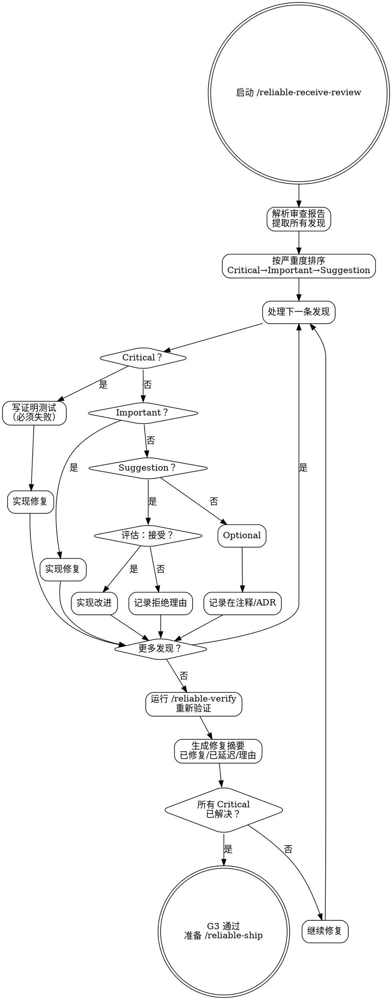

# Reliable Receive Review — 审查反馈处理

**刚性技能**: 严格遵循。不要偏离纪律。

## Overview

系统性处理代码审查的每一条反馈。按严重度排序修复——Critical 必须有证明测试、Important 必须修复、Suggestion 评估后决策。修复后重跑完整验证。

**核心理念**: 审查的价值在于反馈被严谨处理，而非被敷衍接受或盲目执行。默认为 "NEEDS WORK" 直到每条 Critical 被处理。

## When to Use

- 收到 reliable-request-review 的审查报告后
- 收到外部审查者的反馈后
- 需要处理 PR review comments 时

## Core Process

### Step 1: 解析审查报告
- 提取所有发现，含严重度、file:line、建议
- 完成标准: 发现列表已完整提取

### Step 2: 按严重度排序
- Critical 优先，然后 Important，最后 Suggestion
- 完成标准: 处理顺序已确定

### Step 3: 修复循环（每条发现）
- **Critical**: 写一个证明问题的测试（必须失败）→ 实现修复 → 确认测试通过
- **Important**: 用针对性变更修复 → 验证修复解决关注点
- **Suggestion**: 评估 → 如果改善代码且不引入风险就实现 → 如果不做，记录理由
- **Optional**: 记录在代码注释或新 ADR；除非用户选择，否则不改代码
- 完成标准: 每条发现已处理（修复或记录决策）

### Step 4: 重新验证
- 运行 reliable-verify 再次确认：
  - 所有测试通过
  - Lint 清洁
  - 构建成功
  - 修复的新测试包含在内
- 完成标准: 所有检查仍通过

### Step 5: 生成修复摘要
- 哪些发现已修复、如何修复、对应提交
- 哪些发现已延迟、理由
- 每条修复解决了关注点的证据
- 完成标准: 摘要完整

### Step 6: 门禁检查
- 如果所有 Critical/Important 已解决→标记就绪，准备 reliable-ship
- 如果仍存在未解决的 Critical→继续修复
- 完成标准: G3 已确认

<HARD-GATE>
所有 Critical 发现必须修复（或有记录的合理驳回理由）。
修复 Critical 必须有证明测试（先失败→修复→通过）。
修复后必须重跑完整验证。
未经再次验证不要标记审查为"已处理"。
</HARD-GATE>

## Common Rationalizations

| 借口 | 现实 |
|------|------|
| "这个 Critical 发现是误报" | 误报可能但罕见。驳回前先验证。如果确实误报，在修复摘要中记录为什么。 |
| "我可以一次提交修复多个发现" | 每个发现一个提交使回滚精确。仅合并琐碎的关联修复。 |
| "Suggestion 不值得实现" | 记录的拒绝是好的。无声的忽略意味着审查者得不到结果。 |
| "修复很简单，不需要验证" | 简单修复破坏其他东西是经典回归模式。始终重新验证。 |

## Red Flags

- 未记录理由就驳回 Critical 发现
- 修复 Critical 无证明测试
- 修复后跳过重新验证
- 修复一个东西破坏另一个（被 reliable-verify 捕捉到）
- "看起来没问题了"替代实际验证

## Verification

- [ ] 每条 Critical 发现已处理（修复或有记录的驳回）
- [ ] 每条 Important 发现已处理
- [ ] Critical 修复有证明测试
- [ ] 修复摘要清楚地将每条发现链接到其解决方案
- [ ] reliable-verify 在修复后重新运行并通过
- [ ] Suggestion 决策（接受/拒绝）已记录

## 下一步指引

**所有 Critical 已修复时**:
- `/reliable-evolve` — 从本次审查反馈中提取可复用的经验教训

**仍有 Critical 待处理时**:
- `/reliable-build` → `/reliable-verify` — 修复剩余问题并重新验证
- 修复完成后重新运行 `/reliable-request-review` 获取新一轮审查
