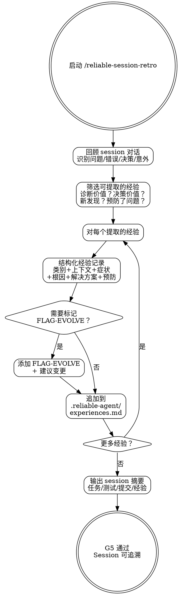

# Reliable Session Retro — 经验提取

## Overview

回顾当前 session，提取可复用的经验教训。经验结构化记录并追加到 `.reliable-agent/experiences.md`（只追加不删除）。标记可能触发进化建议的经验供 reliable-evolve 处理。

**核心理念**: 新鲜的经验是最详细和准确的经验。延迟的回顾含糊且不完整。不记录经验的项目注定重复错误。

## When to Use

- 每个重要工程 session 结束时
- 代码被修改、提交或审查后
- 遇到并解决了非平凡的问题后

**不适用**: 纯讨论 session（无代码修改）。

## Core Process



### Step 1: 回顾 Session
扫描对话记录中的：
- 遇到的问题
- 错误及其根因
- 调试路径（尝试了什么、什么有效）
- 做出的决策及其理由
- 意外（不像预期那样工作的事情）
- 顺利的事情（值得重复的模式）
- 完成标准: 所有重要事件已识别

### Step 2: 筛选可提取的经验
标准——回答 YES 到任一问题：
- 这能帮助未来的人（含未来的你）更快诊断类似问题吗？
- 这能防止类似上下文的错误决策吗？
- 这揭示了一个过去不明显的模式吗？
- 一个流程/技能步骤是否被证明预防了问题？（正向强化）
- 完成标准: 经验列表已筛选

### Step 3: 结构化每条经验
使用标准格式：
```markdown
### EXP-[YYYY-MM-DD]-[NNN]: [简短标题]

- **类别**: error-pattern | optimization-discovery | review-recurrence | workflow-friction | security-finding | process-win
- **日期**: [session 日期]
- **上下文**: [事件发生时我们在构建/修复什么]
- **症状**: [可观察行为——我们看到了什么]
- **根因**: [根本原因——为什么会发生]
- **解决方案**: [什么修复了它]
- **预防**: [什么能防止再次发生]
- **相关文件**: [具体涉及的文件/模块]
- **严重度**: critical | important | notable
- **标签**: [逗号分隔的关键词，便于搜索]
```
- 完成标准: 经验已按格式结构化

### Step 4: 标记进化建议
如果经验明确暗示需要 CLAUDE.md 规则变更或 skill 修改：
- 添加 `[FLAG-EVOLVE]` 标记
- 附注什么应该改变
- 完成标准: 需要进化的经验已标记

### Step 5: 追加到 `.reliable-agent/experiences.md`
- **始终追加**（绝不删除或重写已有记录）
- 添加在适当的类别标题下
- 完成标准: 经验已持久化

### Step 6: Session 摘要
- 完成的任务数
- 新增的测试数
- 提交数
- 记录的经验数
- 完成标准: 摘要已输出

<HARD-GATE>
绝不删除或重写 `.reliable-agent/experiences.md` 中已有的经验记录。
Session 有代码修改时必须运行，不要跳过。
</HARD-GATE>

## Common Rationalizations

| 借口 | 现实 |
|------|------|
| "这个 session 没什么重要的事发生" | 每个 session 都有学习。如果找不到，你看的不够深。即使"一切顺利因为 X"也是学习。 |
| "稍后做回顾" | 细节衰退很快。现在显而易见的根因明天就变成谜团。 |
| "这个经验太具体没什么用" | 具体经验帮助诊断具体问题。泛泛的建议已经在 CLAUDE.md 里了。 |
| "这个经验一次性的" | 造成显著延迟的"一次性"事件值得记录。"不会再发生"是重复发生的方式。 |
| "没有新经验" | 重复也是经验。如果同一个问题第 3 次出现，那是最有价值的记录。 |

## Red Flags

- 代码被修改的 session 不运行 reliable-session-retro
- 只记录症状不分析根因
- 删除或重写已有经验记录（违反追加模式）
- 对明确需要规则变更的经验跳过 FLAG-EVOLVE
- 只有正向总结，没有提取具体可复用的经验

## Verification

- [ ] Session 对话已回顾
- [ ] 至少一条经验被记录（代码变更的 session）
- [ ] 每条经验有: 类别、上下文、症状、根因、解决方案、预防
- [ ] 经验已追加到 .reliable-agent/experiences.md（非覆写）
- [ ] 经验已加标签关键词便于搜索
- [ ] FLAG-EVOLVE 标记已为需要规则/skill 变更的经验添加
- [ ] Session 摘要已输出: 任务、测试、提交、经验数
- [ ] G5: Session 结果持久化且可追溯

## 下一步指引

**推荐路径** → `/reliable-plan` — 开始下一个功能迭代的设计方案

**其他选项**:
- `/reliable-spec` — 如果是新项目，初始化项目规范
