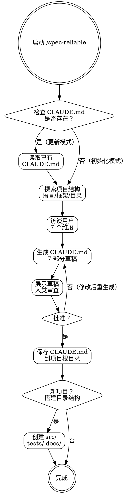

# Reliable Spec — 项目规范初始化

## Overview

生成作为项目宪法的 CLAUDE.md。它定义了项目"怎么算好代码"、"怎么算完成"、"怎么算可靠"。此技能是项目初始化的第一步——所有下游技能依赖此技能产生的 CLAUDE.md。

**核心理念**: 没有宪法就没有标准。前 100 行代码在没有宪法的情况下写出来，就没有继承任何工程纪律。后期再建立标准是代价高昂的补救。

## When to Use

- 新项目启动
- 已有项目缺少 CLAUDE.md
- 需要更新过时的 CLAUDE.md
- 团队约定发生变化需要重新生成

**不适用**: 仅修改一两个配置项——直接编辑 CLAUDE.md。

## Core Process

### Step 1: 检查已有 CLAUDE.md（如存在）
- 读取已有文件了解当前约定
- 初始化模式 vs 更新模式
- 完成标准: 已确认当前项目规范状态

### Step 2: 探索项目结构
- 检测语言（package.json, tsconfig, go.mod 等）
- 检测框架（React, Express, FastAPI 等）
- 检测已有配置文件（.eslintrc, .prettierrc 等）
- 检测目录布局
- 完成标准: 已列出项目技术栈和现有约定来源

### Step 3: 访谈用户 — 7 个维度
一次一个问题，等待反馈：
1. 项目目标和约束
2. 技术栈偏好
3. 团队代码风格约定
4. 测试偏好（框架、覆盖率阈值）
5. 安全需求
6. 性能目标
7. Commit 格式偏好
- 完成标准: 所有 7 个维度有明确答案

### Step 4: 生成 CLAUDE.md
使用 `templates/CLAUDE.md.template` 生成草稿，覆盖：
- Commands（构建/测试/lint/类型检查命令）
- Project Structure
- Code Style（含具体代码示例）
- Testing Strategy（框架+覆盖率阈值+测试层级）
- Boundaries（Always/Ask First/Never）
- Security Baseline（OWASP+密钥管理+依赖审计）
- Performance Baseline（响应时间+内存+模式约束）
- Commit Format（类型+范围+格式示例）
- 完成标准: 7 部分全部填充具体内容

### Step 5: 人类审查
- 展示完整草稿
- 接受修改反馈
- 如果拒绝：循环回到 Step 3 或 4
- 完成标准: 人类明确说"可以"或"批准"

### Step 6: 保存
- 写入项目根目录 CLAUDE.md
- 完成标准: 文件已保存

### Step 7: 新项目搭建
- 如果是新项目，创建 `src/`, `tests/`, `docs/` 目录
- 完成标准: 基本目录结构就位

<HARD-GATE>
在 CLAUDE.md 被保存之前，不要开始任何实现工作。在人类批准之前，不要保存 CLAUDE.md。
在不经过用户访谈的情况下，不要臆测项目需求。
</HARD-GATE>

## Common Rationalizations

| 借口 | 现实 |
|------|------|
| "稍后可以添加 CLAUDE.md" | 前 100 行不受约束的代码没有任何标准。后期添加意味着回溯改造。 |
| "我们团队不需要正式规范" | 规范不是为简单情况准备的——而是为模糊性导致冲突的困难情况准备的。 |
| "简单 README 足够了" | README 记录"是什么"。CLAUDE.md 管治"如何构建"。不同的目的。 |
| "我已经知道项目规范了" | 规范需要被写下来才能被 AI 代理一致地遵守。大脑里的规范不存在。 |
| "技术栈很标准，用默认值就行" | 每个项目都有独特的边界决定。默认值只存在于你的想象中。 |

## Red Flags

- 跳过用户访谈直接生成
- 「这个我帮用户填了」——臆测项目需求
- 生成只有占位符的模板内容
- 省略某些部分（尤其是安全和性能基线）
- CLAUDE.md 未保存就开始写代码

## Verification

- [ ] CLAUDE.md 覆盖全部 7 个必需部分
- [ ] 每个部分包含具体、可执行的内容（非泛泛建议）
- [ ] Commands 部分列出实际可执行命令含参数
- [ ] Boundaries 部分有具体的 Always/Ask First/Never 条目
- [ ] Commit 格式模板存在且可匹配
- [ ] 人类审查并批准了完整的 CLAUDE.md
