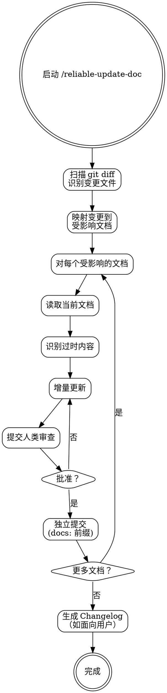

# Reliable Update Doc — 文档同步

**灵活技能**: 根据上下文调整原则。

## Overview

扫描代码变更，识别文档缺口，增量更新文档。文档与代码分开提交。记录的不只是"做了什么"，更是"为什么这么做"。

**核心理念**: "代码自己就是文档"是谎言。代码告诉你"是什么"，不是"为什么"、"怎么用"、"什么决策导致了这里"。

## When to Use

- 代码变更完成但相关文档过时
- reliable-ship 之前检查文档同步
- 架构决策需要新 ADR

## Core Process

### Step 1: 扫描变更
- 从上次文档更新以来扫描 git diff
- 识别变更的文件和模块
- 完成标准: 变更文件列表已生成

### Step 2: 映射到文档
对每个变更区域，确定哪些文档受影响：
- 新功能/新命令 → README
- 架构决策 → 新 ADR 或 ADR 更新
- API 变更 → API 文档
- 面向用户的变更 → Changelog
- 内部变更 → 内联 JSDoc/TSDoc
- 完成标准: 文档影响映射已完成

### Step 3: 审计当前文档
- 读取每个受影响的文档文件
- 找出过时/不匹配的内容
- 完成标准: 每个文档的缺口已识别

### Step 4: 增量更新
- 一次一个文档
- 做针对性的更新
- 验证变更匹配代码
- 完成标准: 文档已更新

### Step 5: 人类审查
- 展示变更
- 等待批准
- 完成标准: 人类批准

### Step 6: 独立提交
- 文档与代码分开提交
- 用 `docs:` 前缀
- 完成标准: 文档已提交

### Step 7: Changelog
- 如果面向用户: `[version] - YYYY-MM-DD -- [变更摘要]`
- 完成标准: Changelog 已更新（如适用）

## Common Rationalizations

| 借口 | 现实 |
|------|------|
| "代码自己就是文档" | 自文档化代码告诉你"是什么"，不是"为什么"、"怎么用"。 |
| "我下个 PR 更新文档" | 延迟的文档是被遗忘的文档。上下文新鲜时更新。 |
| "反正没人看文档" | 凌晨 3 点的值班工程师想理解为什么某个东西是那样工作的，他们会看。 |
| "变更太小不需要文档" | 5 个"太小"的变更 = 不可理解的代码库。文档积累。 |

## Red Flags

- 代码合并但无对应文档更新
- README 引用了不再存在的功能
- 架构决策未写 ADR
- 面向用户的变更未写 Changelog

## Verification

- [ ] 所有变更文件映射到受影响文档
- [ ] 每个过时部分已更新反映当前代码
- [ ] 架构决策有新 ADR（如适用）
- [ ] Changelog 已更新相关条目
- [ ] 人类审查并批准了文档变更
- [ ] 文档提交与代码提交分开

<HARD-GATE>
1. 文档提交必须与代码提交分开——使用 `docs:` 前缀，不混入 `feat:` 或 `fix:` 提交
2. 未经人类审查不要提交文档变更——AI 不独立判断"什么构成正确的文档"
3. 不要删除你不理解的已有文档内容——优先添加或标注为待确认
</HARD-GATE>

## 下一步指引

**推荐路径** → `/reliable-ship` — 文档已更新，进入提交与发布流程
