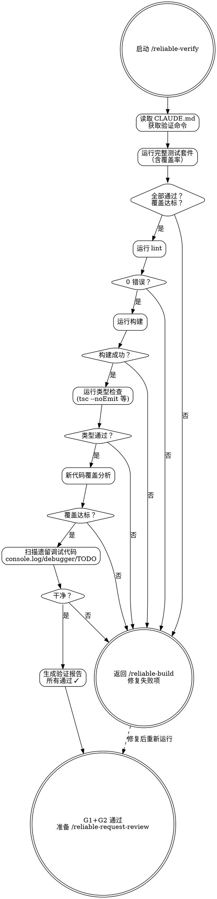

# Reliable Verify — 自动化验证

**刚性技能**: 严格遵循。不要偏离纪律。

## Overview

运行项目的所有自动化验证：测试、lint、构建、类型检查。这是 G1/G2 质量门禁的实施者——任何一项失败则阻塞进入审查。

**铁律**: 如果任何检查失败，STOP。返回 reliable-build。在所有检查全绿之前不要进入审查。

## When to Use

- reliable-build 阶段完成后
- 需要确认代码审查就绪
- 修复审查反馈后重新验证

## Core Process

### Step 1: 读取验证命令
- 从 CLAUDE.md 获取确切的验证命令
- 完成标准: 已确认所有命令

### Step 2: 运行测试套件
- 执行 CLAUDE.md 中的测试命令（含覆盖率 flag）
- 捕获输出
- 覆盖率必须满足 CLAUDE.md 中定义的阈值
- 完成标准: 所有测试通过，覆盖率达标

### Step 3: 运行 lint
- 执行 lint 命令
- 零错误（零警告——如果策略规定）
- 完成标准: lint 清洁

### Step 3a: 风格规范检查（如 codestyle/ 存在）
- 检查 `.reliable-agent/codestyle/` 是否存在
- 如存在，对照声明规范检查变更文件的风格合规性
- 此步骤提供信息性报告，不阻塞 G1/G2
- 严重违规将标记为供 style-auditor 在审查阶段处理
- 完成标准: 风格检查已完成（或跳过——无规范文件时）

### Step 4: 运行构建
- 执行构建命令
- 零错误
- 完成标准: 构建成功

### Step 5: 类型检查
- TypeScript: `npx tsc --noEmit`
- 其他类型语言：等效命令
- 完成标准: 无类型错误

### Step 6: 新代码覆盖检查
- 检查变更区域有对应测试
- 如果覆盖在变更区域下降→标记为 FAIL
- 完成标准: 新代码覆盖满足 CLAUDE.md 阈值

### Step 7: 遗留调试代码扫描
- 搜索: `console.log`, `debugger`, 不带 Issue ID 的 `TODO`
- 标记发现
- 完成标准: 无遗留调试代码

### Step 8: 生成验证报告
- 每类 pass/fail
- 具体失败位置 file:line
- 覆盖摘要（整体 + 变更文件）
- lint 错误数
- 构建状态
- 完成标准: 报告已生成

<HARD-GATE>
如果以下任一项成立，STOP。不要进入 reliable-request-review：
- 任何测试失败
- lint 错误数 > 0
- 构建失败
- 类型检查失败
- 新代码覆盖率低于 CLAUDE.md 阈值
返回 reliable-build 修复失败项。
</HARD-GATE>

## Common Rationalizations

| 借口 | 现实 |
|------|------|
| "只是一个 lint 警告" | 今天的警告是明天被忽略的错误。零容忍是策略。 |
| "测试失败是 flaky 的，我机器上过了" | Flaky 测试就是失败测试。在继续之前修复 flakiness。 |
| "覆盖率接近阈值了" | 阈值存在是因为低于它你不能信任测试套件。"接近"就是低于。 |
| "这只是一个文档变更，不需要完整验证" | 文档变更不会破坏构建——验证成本微不足道但保证一致性。 |

## Red Flags

- 运行验证命令但尽管失败仍继续
- "我在本地跑过了，不用再跑一遍"
- 跳过新代码覆盖分析
- 未读取 CLAUDE.md 的验证命令

## Verification

- [ ] CLAUDE.md 中的所有验证命令已执行
- [ ] 完整测试套件: 100% 通过
- [ ] Lint: 0 错误
- [ ] 风格检查完成（如 `.reliable-agent/codestyle/` 存在）
- [ ] 构建: 成功
- [ ] 类型检查: 成功
- [ ] 新代码覆盖满足 CLAUDE.md 阈值
- [ ] 无遗留调试代码
- [ ] 验证报告已生成并附在 session 中

## 下一步指引

**全部通过时**:
- `/reliable-log` — 检查可观测性（日志/指标/追踪）是否到位
- 或直接 `/reliable-request-review` — 跳过可观测性，直接提交 5-agent 并行审查
- `/reliable-auto` — 自动接管后续流程（审查→修复→验证→文档），一站式完成

**有失败项时**:
- `/reliable-build` — 返回修复测试失败、lint 错误或构建问题，修复后重新验证
